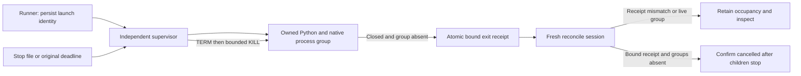

# Cancellation artifact observation

The PC-TX-003 candidate now registers late files separately from technical and creative acceptance. A stop request and a stopped worker remain different states. Existing stop evidence is still required before an attempted task can become cancelled.

The harness records `photocraft-late-artifacts/v1` observations with the original task ID, request identity, owned worker token, output directory, per-file SHA-256, and observation time. Reconcile also observes already-cancelled tasks, allowing a fresh ledger session to register files that arrived after stop confirmation. Repeated identical observations do not add events. Changed snapshots append observations without replacing the earlier evidence.

Observation never executes the skill, replays an edit, parses a delivery claim as acceptance, or changes a cancelled task into completed. Files are hashed with bounded buffers. Symlinks, special files, concurrent changes, and inventories beyond 10,000 entries produce incomplete observations without following an external path or blocking the cancellation transition. Incomplete observations are evidence of missing inventory, not proof of absence or a verified artifact.

The regression uses synthetic worker and native-file fixtures to prove ownership binding, persistence, deduplication, and symlink refusal. It does not prove real native cancellation, interrupted native worker recovery, fixed-install acceptance, or creative quality. Tasks 3.9 and 10.12 remain open until all normative scenarios have current real evidence. Existing public releases do not contain this candidate change.

## Restart supervision candidate

A separate Node supervisor now owns the Python workflow process group. The runner persists launch identity and the original absolute deadline before spawning the supervisor. Only the supervisor sends SIGTERM, followed by SIGKILL after a two-second grace period; reconcile never sends signals to persisted PIDs. The supervisor remains alive when the outer runner is interrupted, observes the same stop file/deadline, and atomically writes an exit receipt only after the workflow has closed and its process group has disappeared.

Reconcile binds the exit receipt to task/request identity, epoch, worker token, skill source, and launch digest. It also checks that the supervisor and workflow process groups are absent. Missing or mismatched receipts retain occupancy and require inspection. A pre-existing stop request or expired deadline prevents workflow startup. Stop/deadline also prohibits explicit verification from promoting a cancelled operation. Old unsupervised ledger entries keep the existing conservative recovery behavior; no migration invents missing stop evidence.

Candidate tests now cover interruption followed by explicit stop, interruption followed by the unchanged deadline, receipt mismatches/live groups, and startup refusal. A native parent/child scenario uses a synthetic review receipt solely to create the revision contract, observes the real native MCP process, interrupts the runner, stops the parent, retains parent occupancy while the child runs, then confirms both cancelled and unchanged source bytes. This is local native evidence; fixed public installation remains unverified, so tasks 3.9 and 10.12 remain open.
