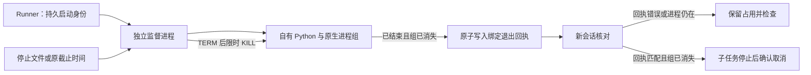

# 取消后的产物观察

固定验收：插件dev.54／技能源dev.44在macOS arm64通过全部PC-TX-003场景。公开ZIP与标签字节一致，固定副本78项Harness、真实原生父子中断停止及迟到原生回复观察通过，安装树不变。四项发布CI通过（Linux合成合同；其中六项原生测试明确跳过）。3.9／10.12完成，现133/157完成、24开放。[验收](evidence/optimization/task-budget-stop/acceptance-audit.json)。下文候选限制记录验收前阶段；完整恢复、GUI所有权、其他原生平台、创作接受和完整V1仍独立开放。

PC-TX-003 候选实现现在将迟到文件与技术、创作验收分别登记。停止请求与工作进程已停止仍是不同状态；已尝试执行的任务仍须具备停止证据，才能进入 cancelled。

Harness 使用 `photocraft-late-artifacts/v1` 记录原任务 ID、请求身份、自有工作进程 token、输出目录、逐文件 SHA-256 和观察时间。核对已取消任务时也会观察文件，允许重新打开账本后登记停止确认之后到达的文件。相同快照不重复增加事件；文件变化后追加观察记录，保留此前证据。

观察不会执行技能、重放编辑、把交付声明当成验收，或将取消任务改成 completed。文件摘要通过固定大小缓冲区计算。符号链接、特殊文件、观察期间变化和超过 10,000 条目的目录清单会产生不完整记录；不会跟随外部路径，也不会阻止取消状态收敛。不完整观察表示清单存在缺口，不证明文件不存在，也不代表产物已验证。

回归测试使用合成工作进程和原生文件 fixture，证明身份绑定、持久化、去重和符号链接拒绝。该证据不证明真实原生取消、中断后的原生进程恢复、固定安装验收或创作质量。任务 3.9 和 10.12 保持开放，直至全部规范场景具有当前真实证据。已有公开发布不包含这项候选变更。

## 重启监督候选

独立 Node 监督进程现在持有 Python 工作流进程组。Runner 在启动监督进程前持久化启动身份和原绝对截止时间。只有监督进程发送 SIGTERM，并在两秒宽限期后发送 SIGKILL；核对逻辑不会向账本中的 PID 发信号。外层执行器中断后，监督进程继续观察同一停止文件和截止时间，仅在工作流已结束且其进程组消失后原子写入退出回执。

核对逻辑检查退出回执绑定的任务与请求身份、epoch、工作进程 token、技能源和启动摘要，并确认监督与工作流进程组均不存在。缺少或不匹配的回执继续保留占用并要求检查。启动前已有停止请求或截止时间已过时，不再启动工作流。停止或预算到期也禁止显式验证提升取消操作的状态。旧的无监督账本记录继续使用保守恢复逻辑；迁移不会补造停止证据。

候选测试覆盖中断后主动停止、中断后沿用原截止时间、错误回执与存活进程组、启动前拒绝。原生父子场景仅用合成审查回执建立修订合同，随后观察真实原生 MCP 进程、中断执行器、停止父任务，在子任务仍运行时保留父占用，最终确认父子均取消且源工程字节未变。这属于本地原生证据；公开固定安装尚未验收，因此 3.9 和 10.12 保持开放。
