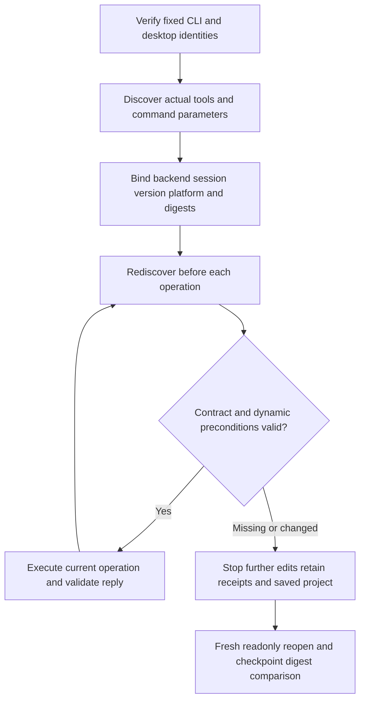

# PhotoCraft backend capability acceptance

This continues OpenSpec task10.3. Source dev.38 adds runtime version/build output/platform to capability snapshots; bridge snapshots also bind the verified desktop version and binary digest. Parameter descriptions remain distinct from per-command JSON Schema; actual MCP tool inputSchema is bound separately. Candidate evidence passes; fixed plugin dev.42 acceptance is pending. Full upgrade/drain/state-compatible rollback task2.6 remains open.

Fourteen native cases cover headless and owned signed desktop normal execution, initially missing required capability, and post-save parameter changes, tool-schema changes and command removal. Faults are injected into readonly discovery replies above real native sessions. Native binaries and installed skills are unchanged; this does not claim spontaneous server drift. Initial absence returns `capability_missing` without edits. Post-save drift returns `capability_mismatch`; the next edit is never called, and saved checkpoints reopen unchanged. Desktop listener PID ownership is verified and owned processes stop; user applications are not controlled.

The ordinary workflow checks capabilities before save/export tool calls as well as command_run. Dynamic enabled depends on document/selection and does not grant authorization. Fixed binary digests bind verified installation version identity. Fixtures without installation identity remain null and cannot prove a release; historical deliveries are not assigned invented fields.

[Source candidate proof](evidence/optimization/capability-source-first-use.json). Run source `tests/test_capability_first_use.py` with `CRAFT_CAPABILITY_FIRST_USE=1` and `CRAFT_INSTALLED_CAPABILITY_SKILL` pointing to the actual installed CLI skill. Optional `CRAFT_CAPABILITY_OUTPUT` and `CRAFT_CAPABILITY_REPORT` must be new owned paths. Bind driver/input/output, fixed source and installed-content digests, and verify the whole installed tree before and after.

Each operation rechecks only its commands, tool schema and discovery-tool dependency against the initial snapshot. Unrelated command/tool drift is recorded by full registry digests without blocking the current operation; attempting that changed capability later still fails. The scoped checks are bound into the delivery manifest and artifact evidence.
