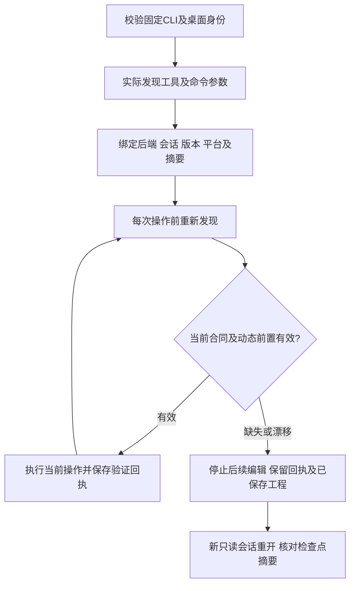

# PhotoCraft 双后端能力验收

本轮继续 OpenSpec 任务10.3。技能源 dev.38 补齐能力快照的运行时版本／构建输出／平台，bridge 另绑定已核验桌面版本与二进制摘要。参数说明仍不是逐命令 JSON Schema；实际 MCP 工具 inputSchema 单独绑定。当前候选证据通过，固定插件 dev.42 验收待完成。完整升级／排空／状态兼容回退任务2.6保持开放。

14个真实原生用例分别覆盖headless与自有签名桌面的正常执行、首次缺少所需命令、保存后的参数变更、工具schema变更和命令移除。故障通过真实原生会话上方的只读发现回复注入，不改写原生二进制／已安装技能，不声称服务自行漂移。首次缺失返回`capability_missing`且没有编辑；保存后漂移返回`capability_mismatch`，下一编辑零调用，工程新会话重开且字节不变。桌面监听器核验所属PID，所有自有进程退出；不控制用户应用。

普通工作流也在保存、导出等工具调用前核对能力，避免只在command_run前检查。enabled依赖实时文档和选择，不能代替用户授权。固定安装器以锁定二进制摘要证明已核验版本身份，临时fixture缺失身份保持null，不升级为发行证明；旧交付不补造新字段。

[来源候选证据](evidence/optimization/capability-source-first-use.json)。复验使用来源仓库`tests/test_capability_first_use.py`，设置`CRAFT_CAPABILITY_FIRST_USE=1`及实际安装的`CRAFT_INSTALLED_CAPABILITY_SKILL`，可指定新的自有`CRAFT_CAPABILITY_OUTPUT`与`CRAFT_CAPABILITY_REPORT`。测试驱动、输入输出、固定来源和安装资源摘要必须同时绑定；整个安装树在执行前后核对。

每次操作只重新核验本次命令、工具 schema 及发现工具依赖，仍使用最初快照为基准。无关命令／工具漂移记录完整发现摘要，不阻止当前操作；之后实际使用变化能力仍拒绝。逐次范围检查随交付清单与 artifact 证据绑定。
