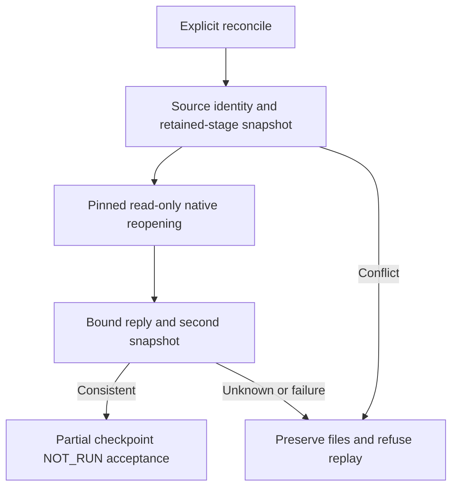

# PhotoCraft checkpoint receipt binding

Existing PC-TX-005/PC-TX-002 and task9.6 remain authoritative. This unpublished candidate follows public plugin dev.46/source dev.40 and changes plugin-owned code only; managed snapshots, runtime locks and existing public tags are unchanged. Fixed candidate installation is NOT_RUN. No tasks close.

Explicit reconcile checks skill identity and captures authorized failure records and every declared saved file digest/size before calling the pinned read-only checkpoint verifier. The reply must bind the same stage, record, project, runtime, operation count and last request, confirm native reopening, prohibit replay and retain technical/creative NOT_RUN. Files and skill identity are checked again afterward. Unknown fields, contradictory success, escaping paths, changed files or mismatched semantics refuse. Failed checks revoke current checkpoint acceptance while preserving original files, execution outcomes and ledger history.

Strict JSON retains duplicate/nonfinite rejection and restores JSON.parse-compatible configurable object properties so stale checkpoint acceptance can be removed. Known verifier failures remain failed; unproven replies or identities remain unknown. Neither proves that the original edit was unexecuted.

Twenty checkpoint contract tests cover bound success, wrong identities, stale acceptance revocation, external changes, conflicting records, escaping paths and source drift. The actual native case saves a transparent text project then fails JPEG transparency acceptance; a wrong-runtime reply refuses, fresh read-only reopening accepts only a partial checkpoint, retained file bytes remain unchanged and repeat run refuses. Final validation passes70 plugin TypeScript tests (including4 native cases),48 Python tests and14 checks. The234 source tests are reused only with identical source fingerprints and native/desktop layers.

[Candidate and fingerprints](evidence/optimization/checkpoint-contract-candidate.json) · [Regression](evidence/optimization/checkpoint-contract-validation.json). Raw per-command stopping, streaming contracts, pinned-source checkpoint inner tool reply semantics and the full-entry fixed installation/counter matrix remain unaccepted. Task9.6 and all28 remaining tasks stay open; full V1 remains incomplete.
