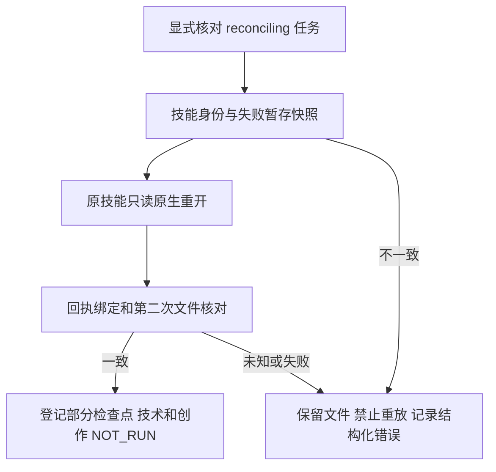

# PhotoCraft 检查点回执绑定

既有 PC-TX-005／PC-TX-002 与任务9.6继续作为事实源。本候选基于公开插件dev.46／技能源dev.40，只修改插件自有代码；管理快照、运行时锁和公开标签不变。候选尚未发布，固定副本未复验，不关闭任何任务。

`reconcile` 先核对技能身份，捕获授权根内的原失败记录、原暂存记录和每个已声明文件的摘要与大小，再调用锁定技能的检查器。回执必须绑定同一暂存路径、记录、工程、运行时、操作数和最后请求；必须明确原生重开、禁止重放且技术与创作均为NOT_RUN。检查器调用后重复核对文件和技能身份。未知字段、矛盾成功、路径逃逸、文件变化及语义不匹配均拒绝。检查失败撤销当前检查点接受状态，原文件、原执行结果及历史账本事件保留。

严格JSON解析仍拒绝重复键和非有限值；解析对象属性恢复与JSON.parse一致的可删除语义，避免失效检查点无法撤销。已知检查器失败记录failed；无法证明回执或身份时记录unknown，二者都不证明原编辑未执行。

验证：20项检查点合同测试覆盖合法回执、错误身份、旧接受状态撤销、外部写方、双份记录冲突、路径逃逸和源变化。真实原生案例以透明文字导出JPEG，在实际保存工程后被透明度验收拒绝；错误运行时回执拒绝，随后原工程只读重开接受为部分检查点，所有暂存文件字节不变，重复run拒绝。最终70项插件TypeScript（含4项原生）、48项Python、14项检查通过；234项源测试按完全相同指纹和native/desktop层级复用。

[当前候选与摘要](evidence/optimization/checkpoint-contract-candidate.json) · [完整回归](evidence/optimization/checkpoint-contract-validation.json)。这些证据不代替原生逐命令停止、MCP流式合同、技能源检查点内层工具回复语义或全入口固定安装／计数器验收。9.6和总计28项任务仍开放；完整V1未完成。
