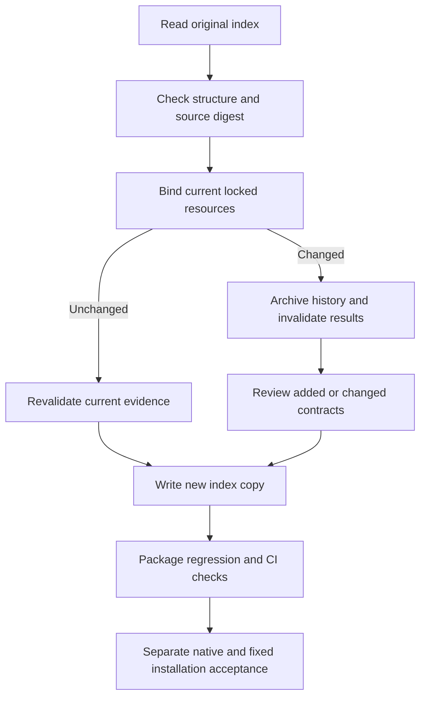

# PhotoCraft command evidence index maintenance

PC-CM-001-INDEX, task13.2. Source dev.59 contains755 commands; all1,510 headless/bridge contexts remain NOT_RUN and require individual prerequisite review. Tasks13.2,13.3 and fullV1 remain open.

The current index at `docs/evidence/optimization/command-acceptance/current-index.json` binds scripts, JSON resources and native snapshots from the locked skills. The original command-acceptance-index.json is retained as history.

```bash
python3 -I -B scripts/command_acceptance.py refresh \
  --skill-root skills/photocraft-use \
  --index docs/evidence/optimization/command-acceptance/current-index.json \
  --output NEW_INDEX.json
python3 -I -B scripts/command_acceptance.py check \
  --skill-root skills/photocraft-use --index NEW_INDEX.json
```

The output must not exist. Unchanged resources still require validation of current evidence references and digests; use --evidence-root for the proof root. No-op refresh preserves content without appending history. Changed resources move old PASS/FAIL/NOT_APPLICABLE results and attached evidence into history with original source, runtime and command identities, then reset current status to NOT_RUN. Changes to the contract, owner skill or backend registration reset prerequisites to UNKNOWN and require review. Retired commands remain complete in retiredCommands; new commands never pass automatically.

Multiple scenarios on one backend require distinct contextId values; legacy rows default to their backend identity and cannot repeat. Invalid structure, source digests or Unicode encoding is rejected before creating output. Existing targets are never overwritten. Historical references cannot satisfy current acceptance; maintenance does not authenticate their original execution.



CI and package checks establish resource binding, inventory integrity and invalidation behavior. They do not execute755 native commands, launch GUI, prove reviewed prerequisites or establish creative/model acceptance. Each actual acceptance still needs source/input/plan/receipt/project/revision identities and independent assertions.
