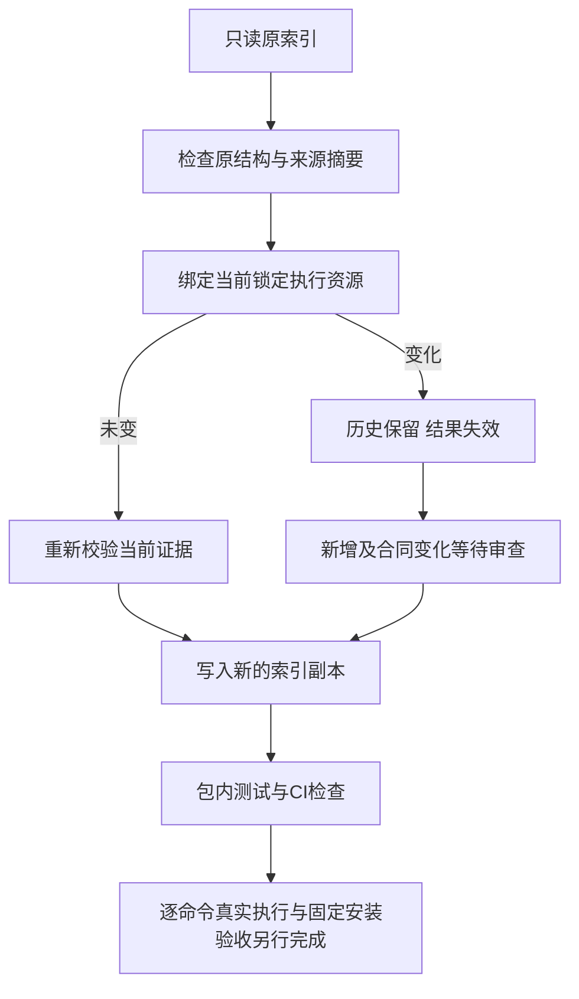

# PhotoCraft 逐命令证据索引维护

对应 PC-CM-001-INDEX 和任务13.2。当前技能源dev.59包含755条命令；headless／bridge共1510个上下文记录均为NOT_RUN，前置条件仍待逐项审查。13.2、13.3及完整V1保持开放。

`docs/evidence/optimization/command-acceptance/current-index.json`绑定当前锁定技能的脚本、JSON资源及原生快照。原始`command-acceptance-index.json`保留为历史，不覆盖人工记录。

```bash
python3 -I -B scripts/command_acceptance.py refresh \
  --skill-root skills/photocraft-use \
  --index docs/evidence/optimization/command-acceptance/current-index.json \
  --output NEW_INDEX.json
python3 -I -B scripts/command_acceptance.py check \
  --skill-root skills/photocraft-use --index NEW_INDEX.json
```

`NEW_INDEX.json`必须尚不存在。没有资源变化时仍检查当前证据引用和摘要，可用`--evidence-root`指定证据根；刷新保留索引内容，不增加历史。资源改变时，旧PASS／FAIL／NOT_APPLICABLE及附带证据移入含原来源、运行时与命令合同身份的history，当前状态退回NOT_RUN。合同、归属技能或后端注册改变时，前置条件退回UNKNOWN并要求重新审查。移除命令完整保留在retiredCommands中，新增命令不自动通过。

同后端可以有多个场景，但须指定不同的`contextId`；没有该字段时以backend为默认身份，不允许重复。索引结构、来源摘要或Unicode编码无效时，拒绝发生在新输出创建前；已有目标拒绝覆盖。历史引用不能作为当前通过证据，历史来源真实性也不由维护工具证明。



CI和包内测试只检查资源绑定、清单完整与失效规则；不执行755条原生命令、不启动GUI、不证明前置条件已审查，也不提升原生／创作／宿主模型通过状态。跨来源历史保留用于追溯，实际验收仍须重新绑定源、输入、计划、回执、保存工程、局部修订和独立断言。
