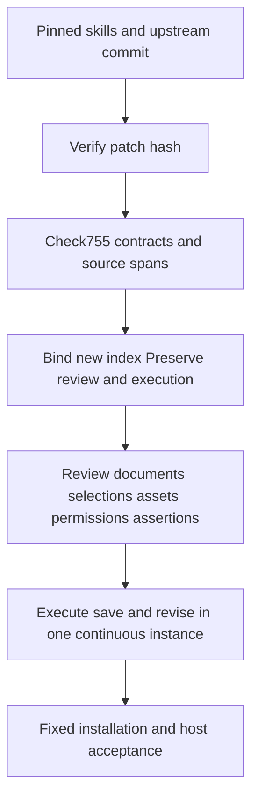

# PhotoCraft command enabled-source binding

PC-CM-001-SOURCE and task13.2: all755 command IDs and exact parameter contracts are bound to registration spans, macro or generation locations and enabled predicate definitions from the pinned maintained upstream. These facts support prerequisite review; they do not prove GUI enablement, complete asset/permission requirements or execution results.

The profile and current index live in `docs/evidence/optimization/command-acceptance/`. Rust syntax-tree analysis matched each published ID and parameter string, including const generics, local function aliases, adjustment commands and gallery filters. No command-prefix inference was used. The analysis tool is local; the verifier uses Python standard-library facilities only.

```bash
python3 -I -B scripts/command_source_contexts.py check \
  --skill-root skills/photocraft-use \
  --index docs/evidence/optimization/command-acceptance/current-index.json \
  --profile docs/evidence/optimization/command-acceptance/source-contexts.json \
  --source-root MAINTAINED_UPSTREAM
```

Use the pinned upstream commit with the engine changes from the independent skill source's `runtime/patches/supervised-droplet.patch`. First verify the patch hash and commit against `runtime/supervised-droplet-patch.json`. CI checks out both locked authorities, verifies patch identity, applies engine changes and validates every referenced file and line-span SHA-256.

Without `--source-root`, the result explicitly reports `upstreamBytes=NOT_VERIFIED`. With source files, `VERIFIED` means byte/range verification; authenticity still relies on checkout and patch identity. Missing files, changed digests, duplicate/missing commands, contract drift, unsafe paths and symlink escape are rejected.

`bind` uses the same inputs and requires actual source plus a new `--output NEW_INDEX.json`. It adds only the top-level profile identity; input and per-command review/execution records remain unchanged. Resource refresh drops obsolete bindings, requiring a new source binding. Historical source facts cannot promote current results.



Reviewed and accepted command counts remain0; all1510 contexts remain NOT_RUN. Static predicates do not establish complete business prerequisites; their dependent call paths still require review. Tasks13.2,13.3 and8.3 remain open. The checker starts no native or GUI instance.
