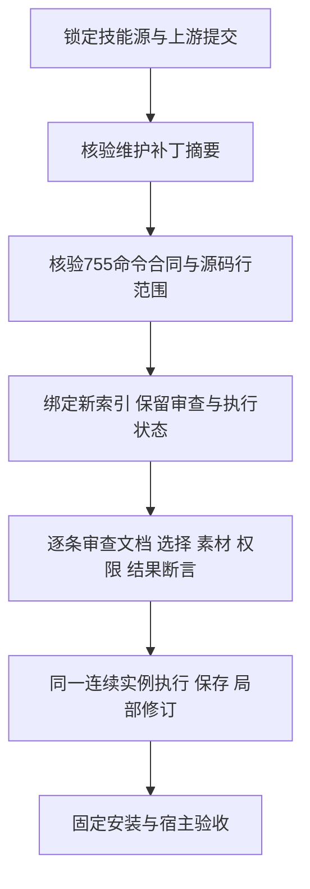

# PhotoCraft 命令启用条件源码绑定

对应 PC-CM-001-SOURCE 与任务13.2；755条命令均已绑定精确参数合同、注册位置、宏定义或生成表、启用谓词定义。来源为锁定上游提交加固定技能发布的维护补丁。源码位置与摘要能提供前置条件审查线索，不能证明GUI启用、完整素材／权限要求或实际结果。

`source-contexts.json`和`current-index.json`位于`docs/evidence/optimization/command-acceptance/`。注册事实整理采用Rust语法树，逐条匹配已发布目录中的ID与参数原文；包括常量泛型、局部函数别名、调整命令和画廊滤镜，未按命令前缀猜测。整理工具是本地分析工具，验证器仅使用Python标准库。

```bash
python3 -I -B scripts/command_source_contexts.py check \
  --skill-root skills/photocraft-use \
  --index docs/evidence/optimization/command-acceptance/current-index.json \
  --profile docs/evidence/optimization/command-acceptance/source-contexts.json \
  --source-root MAINTAINED_UPSTREAM
```

`MAINTAINED_UPSTREAM`须是固定上游提交，并应用独立技能源`runtime/patches/supervised-droplet.patch`中engine目录的变更。先用独立的`runtime/supervised-droplet-patch.json`验证补丁摘要与提交。CI从锁定技能源及上游提交检出文件，验证补丁身份后应用，并检查全部文件和引用行范围的SHA-256。

省略`--source-root`只能检查目录身份与来源声明，报告`upstreamBytes=NOT_VERIFIED`。提供实际源码时报告`VERIFIED`只表示文件和行范围字节核验，源码真实性仍依赖检出和补丁身份。文件缺失、摘要变化、重复或缺失命令、参数合同漂移、非法路径及链接逃逸均拒绝。

`bind`采用相同参数，并要求实际来源与尚不存在的`--output NEW_INDEX.json`；只增加顶层来源身份，原索引只读，每条命令的审查与执行状态原样保留。刷新执行资源后旧来源绑定被丢弃，须重新绑定；不能用历史来源提升当前结果。



当前人工上下文审查为0、已验收命令为0；1510个上下文均为NOT_RUN。静态启用函数不等于完整业务前置条件，函数本身依赖的调用链也须在逐项审查中核实。13.2、13.3及原8.3保持开放，不由源码绑定或开发发布勾选。检查器不启动原生或GUI实例。
