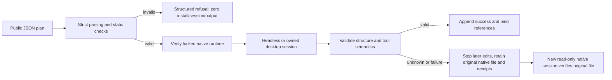

# Public entry contract acceptance

The normative contract remains PC-TX-005 in the existing OpenSpec change. Source dev.39 fixes observed defects: missing field locations, unhandled non-string command/alias values, and unverified save replies being recorded as success. Existing error codes remain stable; validation errors additionally expose `category: validation_failed` and `fieldPath`. Save/export results must contain a nonempty path and, when present, an array of warnings before success or alias binding. Declared extension fields and legal legacy plans remain accepted.

Run `python3 -I -B scripts/verify_entry_contract.py --skill-root ACTUAL_SKILL_DIRECTORY --tests-root VERIFIED_SOURCE/tests --output NEW_EXTERNAL_DIRECTORY --scope candidate` or use `--scope fixed-installed` for the actual immutable installation. The output directory must be new and outside the tested skill and test source. Test fixtures only observe and replace replies after the real native save; installed files and binaries are never edited. Proxy captures are not recovery inputs.

The matrix checks all three editing entries (`workflow.py`, `commands.py`, `desktop.py`), static rejection paths with instrumented zero installer/session/download counts, retained user/cache markers, actual native create/save/reopen, source-bound revision, dynamic missing-field stop, and structural/semantic reply failures. Each faulty save is sent once, later operations stop, same-output repetition is refused, and the original native project opens in a fresh session without changing its digest. Desktop checks own a signed application and verify both its listener and process cleanup. Image replies use the actual preview tool; successful legacy shape parameters and source-manifest references remain covered.

Candidate and public fixed-installed records are separate. These checks do not establish all-command context acceptance, host-model routing, independent creative review, runtime upgrade/drain/rollback, or complete V1 acceptance. A development release remains ineligible for marketplace publication until its separate gates pass.

Known creation replies must identify a nonnegative document index; open replies may use the headless index shape or the owned desktop path/warnings shape; inspect replies must expose a valid canvas and layer container. Ambiguous results remain submitted/unknown without success receipts. Legacy `index`/`document` shapes and declared extension fields are preserved.

Task9.6 remains open. The three plan-runner matrices do not establish every public editing entry: cli.py native argv passthrough attempts installation before rejecting duplicate JSON keys. The observer counted one installer call and blocked the actual installation; no structured preflight error was returned. Native argv compatibility, preflight/result semantics and public Harness execution/revision entry coverage still need work.

Public dev.44/source39 installation: Codex discovered14 skills with0 loading errors. Each of the candidate and fixed matrices passed52 preflight and48 native/desktop cases; fixed13 cold single-skill probes and13 contract/native tests also passed. The full installed tree remained unchanged. The passthrough failure reproduced in the actual installation, so9.6 remains open. Release commit1e1a22d24e27b8537d51fd74e1f41d06c5050c7e and the4 release/main CI runs passed; source231 local tests have no source-repository CI substitute. See [partial coverage](evidence/optimization/entry-contract/coverage-audit.json) and [publication](evidence/optimization/entry-release-publication.json).
