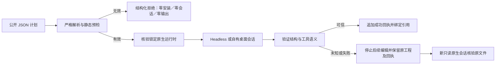

# 公开入口合同验收

规范事实源仍是现有 OpenSpec 变更中的 PC-TX-005。技能源dev.39 修复实际缺陷：预检缺少字段位置、非法命令／别名类型泄漏未处理异常、未验证的保存回复被记为成功。已有错误码保持兼容，预检新增 `category: validation_failed` 与 `fieldPath`。保存／导出结果必须包含非空路径，若带 warnings 则必须为数组，之后才能登记成功和绑定别名；声明的扩展字段和合法旧计划保持兼容。

复验命令为 `python3 -I -B scripts/verify_entry_contract.py --skill-root 实际技能目录 --tests-root 已验证技能源/tests --output 新的外部目录 --scope candidate`；实际不可变安装使用 `--scope fixed-installed`。输出必须为被测技能和测试源之外的新目录。测试代理只在真实原生保存成功后观察并替换回包，不修改安装文件或二进制；代理捕获副本不作为恢复输入。

矩阵覆盖 `workflow.py`、`commands.py`、`desktop.py` 三个公开编辑入口：带安装器／会话／下载计数的静态拒绝、用户和缓存标记保全、实际创建／保存／重开、源版本绑定修订、动态字段缺失停止以及结构／语义回包错误。每个故障保存只发送一次，后续操作停止，同输出重复执行拒绝，新会话重开原文件且摘要不变。桌面验收启动自有签名应用，核对监听端口归属和进程清理。图片回复来自实际预览工具；合法旧 shape 参数及源清单绑定仍有验证。

候选和公开固定安装分别保留证据。这些检查不代替逐命令上下文验收、宿主模型路由、独立创作评审、完整运行时升级／排空／回退或完整首版验收；开发发行在独立门禁通过前不具备市场上架资格。

创建回复必须识别非负文档索引；打开回复兼容headless索引及桌面路径／警告形态；检查回复必须提供有效画布与图层容器。语义不明确时保持submitted／unknown，不追加成功回执；兼容已有index／document形态及声明的扩展字段。

任务9.6保持未完成。三个计划入口的矩阵不能代表所有公开编辑入口：cli.py 原生argv透传收到重复JSON键时先尝试安装，安装调用计数为1（测试观察器已阻止实际安装），未返回结构化预检错误。还需补齐透传入口的合法旧argv、静态拒绝和结果语义，并审计公开Harness执行／修订入口。

公开dev.44／源39固定安装：Codex发现14项技能，加载错误0。候选与固定矩阵分别通过52项预检、48项原生／桌面场景；固定13项独立空缓存探测及13项合同／原生测试也通过，整个安装树摘要保持不变。实际安装仍复现透传缺口，因此9.6保持未完成。发布提交1e1a22d24e27b8537d51fd74e1f41d06c5050c7e对应4项标签／主分支CI通过；技能源231项本地测试不冒充源仓CI。见[局部覆盖](evidence/optimization/entry-contract/coverage-audit.json)和[发行证据](evidence/optimization/entry-release-publication.json)。
