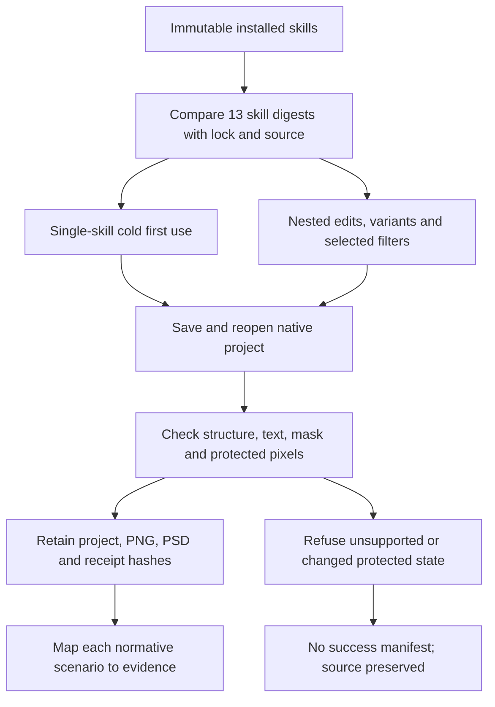

# PhotoCraft fixed domain acceptance

The current immutable plugin dev.39 / skills dev.35 installation passes the 16 normative scenarios of PC-DM-001, PC-DM-002, PC-DM-003 and PC-DM-007 on macOS arm64 with native CLI 0.2.0-craft.1. This closes tasks 4.3, 4.6, 4.9, 12.3, 12.6, 12.9 and 12.15. The plan is 120/157 complete, with 37 gates open. See the [scenario audit](evidence/optimization/domain-acceptance-audit.json) for exact evidence hashes and limits.



The run contains 11 first-use/native tests, 26 additional native cases, one separate cold masked-adjustment test and three supplemental preflight refusals. All native tests have zero skips. The original six first-use groups passed; the first additional run failed because the test fixture reached a size mismatch before the intended missing-transform check. That failed report is retained. The corrected additional cases ran afresh. Only the unchanged, independently passed first-use groups were reused, after checking runner AST, test-driver hashes, installed resources and retained artifacts. All 57 source test dependency files match the released skills commit.

The final run indexes 301 retained artifacts; its first-use baseline indexes 562 and the masked-adjustment supplement indexes 27. Native/media files and downloaded runtimes remain outside Git. The separate [mask facts](evidence/optimization/fixed-mask-binding.json) confirm the same owner, enabled/link state and mask tile digest before and after the editable adjustment changes target pixels; protected control pixels remain identical.

From the plugin repository, run the maintainer verifier against an existing immutable installation and a new owned artifact directory:

```bash
python3 -B scripts/verify_fixed_domain.py \
  --skills-repo "$PHOTOCRAFT_SKILLS_REPOSITORY" \
  --installed "$PHOTOCRAFT_FIXED_PLUGIN" \
  --artifacts "$PHOTOCRAFT_NEW_ARTIFACT_DIRECTORY" \
  --report "$PHOTOCRAFT_ACCEPTANCE_REPORT"
```

The verifier covers the six first-use groups and 26 additional cases. The separate adjustment test uses `CRAFT_PHOTO_ADJUSTMENT_FIRST_USE=1`, `CRAFT_PHOTO_ADJUSTMENT_SKILL` pointing at the installed adjustment skill and `CRAFT_PHOTO_ADJUSTMENT_REPORT` for its receipt, with the released `test_adjustment_mask_first_use.AdjustmentMaskNative` driver. The committed audit records the retained native projects and the read-only mask-facts check from this run. The optional verifier reuse arguments require a previous report, its artifact directory and exact previous driver; they never reuse failed additional cases. Reuse guard behavior is covered by four local unit tests.

This acceptance includes explicit refusal boundaries: unavailable glyph coverage or overflow metrics, smart-filter editability and non-RGB8 protection are not claimed as supported. PSD output is inspected for the features used in these cases; complete required-feature-loss gating and external-editor fidelity remain open. Model routing, independent creative acceptance, all-command execution and other platforms remain separate gates. The OpenSpec change stays active, without sync/archive, and marketplace eligibility and supported host declarations remain unchanged.

Evidence: [first run](evidence/optimization/fixed-domain-first-run.json), [final native cases](evidence/optimization/fixed-domain-acceptance.json), [preflight/dependency supplement](evidence/optimization/fixed-domain-boundary-supplement.json), [masked adjustment](evidence/optimization/fixed-mask-native.json).
