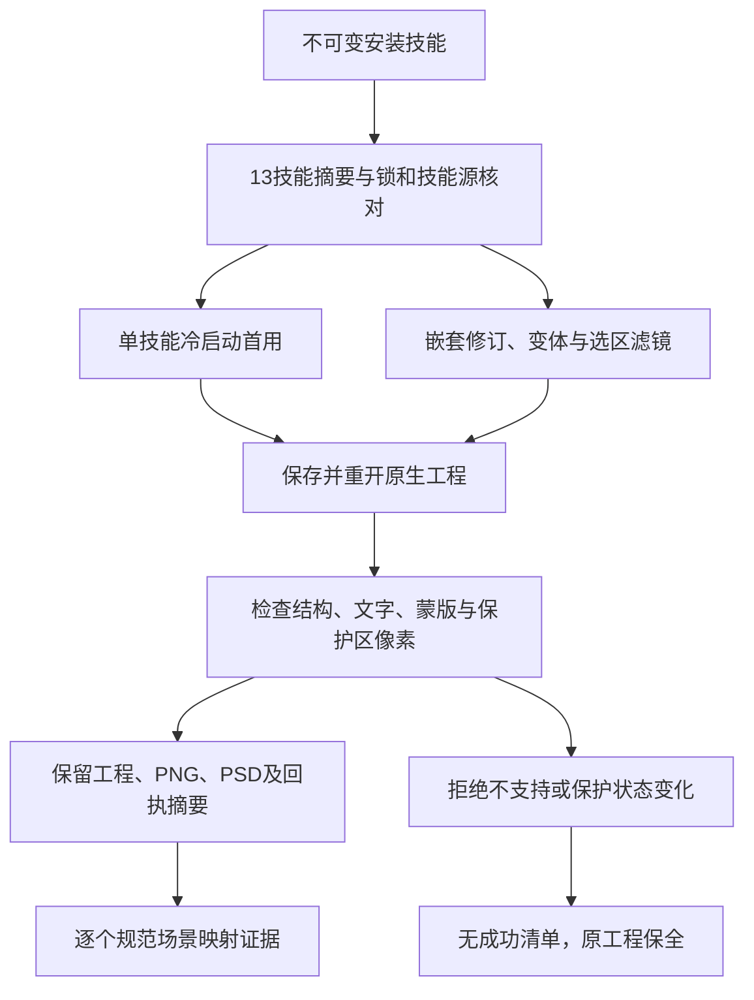

# PhotoCraft 固定安装领域验收

当前不可变插件 dev.39／技能 dev.35 安装，在 macOS arm64、原生 CLI 0.2.0-craft.1 上通过 PC-DM-001、PC-DM-002、PC-DM-003、PC-DM-007 的16个规范场景，关闭任务4.3、4.6、4.9、12.3、12.6、12.9、12.15。计划累计120/157项完成，37项门禁开放。[逐场景审计](evidence/optimization/domain-acceptance-audit.json) 绑定证据摘要和具体边界。



本次包含11项首用／原生测试、26个追加原生用例、1项独立冷启动蒙版调整测试和3项补充预检拒绝，原生测试零跳过。首次六组首用测试通过，但追加测试的输入先触发了尺寸不符，未到达预期的缺少变换门禁；失败报告保留。修正输入后，追加场景全部重新执行。仅独立通过且未变化的首用组被复用，复用前核验驱动 AST、测试文件摘要、安装资源及保留制品；57个来源测试依赖文件均与已发行技能提交一致。

最终追加运行索引301个保留制品；首用基线索引562个，蒙版调整补充索引27个。原生工程、媒体和下载的运行时保留在 Git 之外。[蒙版事实补充](evidence/optimization/fixed-mask-binding.json) 确认：可编辑调整改变目标像素后，蒙版仍绑定同一图层，启用／链接状态和瓦片摘要一致，保护区控制像素不变。

在插件仓库内，指定已有不可变安装及新的自有制品目录执行维护者验收器：

```bash
python3 -B scripts/verify_fixed_domain.py \
  --skills-repo "$PHOTOCRAFT_SKILLS_REPOSITORY" \
  --installed "$PHOTOCRAFT_FIXED_PLUGIN" \
  --artifacts "$PHOTOCRAFT_NEW_ARTIFACT_DIRECTORY" \
  --report "$PHOTOCRAFT_ACCEPTANCE_REPORT"
```

验收器覆盖六组首用和26个追加用例。独立蒙版调整使用已发行的 `test_adjustment_mask_first_use.AdjustmentMaskNative` 驱动，设置 `CRAFT_PHOTO_ADJUSTMENT_FIRST_USE=1`、指向安装调整技能的 `CRAFT_PHOTO_ADJUSTMENT_SKILL` 和输出回执的 `CRAFT_PHOTO_ADJUSTMENT_REPORT`。本轮审计绑定其保留工程及只读蒙版事实检查。验收器可选复用参数必须同时提供原报告、制品目录和确切旧驱动；失败的追加场景不会复用。复用门禁有4项本地单元测试。

验收包含明确的拒绝边界：无法取得的缺字／溢出指标、可编辑智能滤镜和非 RGB8 保护不宣称支持。PSD 检查覆盖本轮实际使用的特性，必要功能损失门禁和外部编辑器保真仍开放。模型路由、独立创作接受、逐命令执行及其他平台分别验收。OpenSpec 变更保持活跃，不执行同步／归档，不提升市场资格或通用宿主支持状态。

证据：[首次运行](evidence/optimization/fixed-domain-first-run.json)、[最终原生用例](evidence/optimization/fixed-domain-acceptance.json)、[预检与依赖补充](evidence/optimization/fixed-domain-boundary-supplement.json)、[蒙版调整](evidence/optimization/fixed-mask-native.json)。
