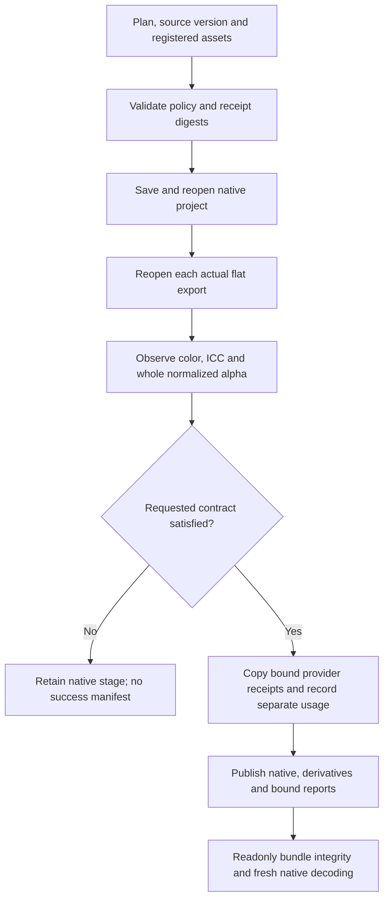

# PhotoCraft flat export acceptance

The dev.37 source candidate implements PC-DM-006 through an optional `flatExport` contract and bound existing provider receipts. Native projects remain authoritative. Fixed dev.41 acceptance is pending; actual provider service/billing, external print fidelity and full V1 are not claimed.

PNG, JPEG, TIFF and WebP are reopened by the pinned native decoder. The report binds native and source digests, actual color mode, embedded ICC bytes, dimensions, normalized RGBA8/alpha hashes and actual exported-file identity. Full alpha comparison detects partial transparency loss that a channel/header check misses. `preserve`, `opaque` and `any` express distinct requested behavior. The optional surface contract currently requires an RGB8 native source; other modes/depths refuse before runtime installation. Existing plans without this contract retain previous behavior.

Existing generated assets register provider/model/request IDs, image digest, original JSON receipt digest and upstream declared usage. Raw receipt bytes are copied into the manifest and inherited only for unchanged assets; replacing an asset drops the old receipt. Upstream declared units remain separate from executed local plan operations and zero cloud-generation calls. Checksums do not authenticate the provider or bill; source authenticity stays NOT_PROVEN. Tests use an explicitly labeled provider fixture, never claim live generation or billing acceptance.

The unit suite verifies invalid-contract zero-install/output refusal, whole-alpha checks, color/ICC mismatch, missing reports, receipt/image binding and unknown provenance rejection. The native single-export-skill test uses a new runtime directory, transparent pixels and explicit sRGB; checks PNG/TIFF/WebP, native/flat fresh reopen and exact inherited receipts; refuses transparent JPEG, wrong ICC, bad receipts before side effects and same-name replacement. A coherently rehashed forged color observation passes hash checks but fails fresh native reopening. The first native run reached the intended JPEG refusal; its test resolved the relative retained-stage path from the wrong directory. The corrected run uses the failure-directory base and reopens the preserved project without changing its bytes.

Run the released source `tests/test_flat_export_first_use.py` with `CRAFT_FLAT_EXPORT_FIRST_USE=1`, `CRAFT_INSTALLED_FLAT_EXPORT_SKILL` set to the actual installed export skill, and optional fresh owned `CRAFT_FLAT_EXPORT_OUTPUT` / `CRAFT_FLAT_EXPORT_REPORT` paths. Source and installed hashes, provider-fixture identity, native/runtime versions and each retained input/output digest are required for fixed evidence. Read the self-contained `references/flat-export.md` contract inside the loaded skill.

Malformed saved observations return `flat_report_invalid` during source preflight rather than an uncaught type/key error. The target test failed with KeyError before the guard and passes afterward.
