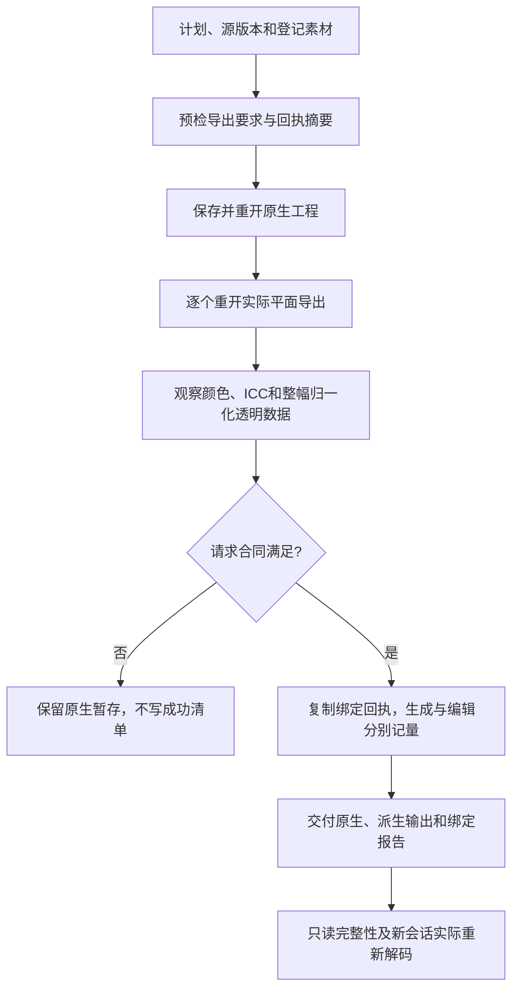

# PhotoCraft 平面导出验收

技能源 dev.37 候选通过可选 `flatExport` 与已有供应方回执实现 PC-DM-006。原生工程保持权威，dev.41 固定安装验收待完成；真实生成服务／计费、外部印刷保真及完整首版不在当前通过声明中。

固定原生解码器重开 PNG／JPEG／TIFF／WebP。报告绑定当前原生和源摘要、实际颜色模式、ICC字节摘要、尺寸、归一化RGBA8／整幅alpha与导出文件身份，不能以有alpha通道代替透明保全。`preserve/opaque/any` 是不同请求；当前可选像素合同限RGB8原生源，其他模式／位深在安装前拒绝；旧合法计划保持兼容。

生成素材登记供应方／模型／请求ID、素材摘要、原始JSON回执摘要及上游声明用量，按字节复制并登记清单。未替换素材另存时继承原回执，替换素材不得继承旧来源。不同上游单位不汇总，本地执行计划操作数及零云生成调用分别记录。摘要不能认证供应方或账单，来源真实性保持NOT_PROVEN；测试使用明确命名的供应方夹具，不宣称真实服务或计费验收。

单元测试覆盖非法合同的零安装／零输出、整幅透明比较、颜色／ICC错配、缺失报告、回执与素材绑定及错误来源拒绝。原生单导出技能空运行时测试使用真实透明像素和显式sRGB，验证PNG／TIFF／WebP、原生与导出重开及回执继承；拒绝JPEG透明损失、ICC错配、坏回执和同名替换。完整重新计算摘要后的伪造颜色观察仍由新会话实际重开拒绝。首次原生运行已达到预期JPEG拒绝，但测试错误解析相对暂存路径；修正为从失败目录解析后，可只读重开保留工程并证明字节不变。

从已发布技能源运行 `tests/test_flat_export_first_use.py`：设置 `CRAFT_FLAT_EXPORT_FIRST_USE=1`、实际安装的 `CRAFT_INSTALLED_FLAT_EXPORT_SKILL`，可选新的自有 `CRAFT_FLAT_EXPORT_OUTPUT` 和 `CRAFT_FLAT_EXPORT_REPORT`。固定证据须绑定来源／安装摘要、供应方夹具身份、运行时版本及实际保留的输入输出摘要。技能内 `references/flat-export.md` 自包含合同。

畸形已保存观察在源预检阶段返回 `flat_report_invalid`，不再抛出未捕获的类型／键异常。目标测试在修复前出现KeyError、修复后通过。
