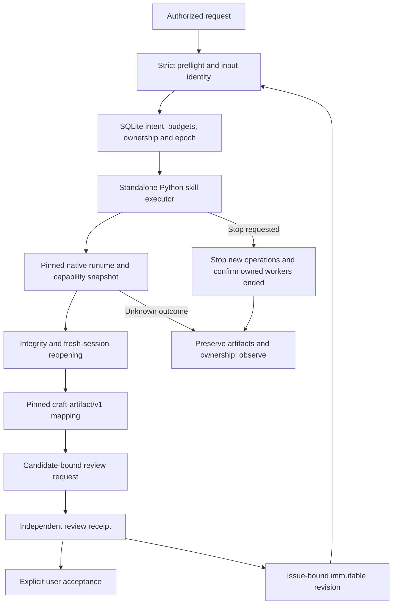

# PhotoCraft task-control candidate

This implementation belongs to `openspec/changes/establish-v1-plugin`. Plugin dev.39 locks the published standalone dev.35 source. It includes the plugin-local `photocraft-harness` skill and TypeScript runtime. Source regression and fixed-installation acceptance are recorded separately; complete V1 remains open.

Standalone resources add read-only `workflow.py --check`, strict JSON and structured errors, command-description and MCP-schema fingerprints, recursive object assertions, bounded property preservation, an observed PSD feature matrix, and explicit filter context. Legacy shape aliases remain supported. Unreported overflow metrics, mask enablement and complete editable smart-filter graphs cannot be inferred as passing.

`src/cli.ts` exposes create/run/status/reconcile/verify/judge/review-import (import-judge)/revise/stop/accept/artifact. SQLite persists request identity, intent, budgets, leases and events. Unknown work cannot be claimed again. Only the executor's currently owned process group receives termination signals; restart reconciliation observes stored identities without killing by historical PID. Mutable desktop editing is rejected because disk state cannot prove the absence of unsaved GUI changes.

Artifact mapping consumes byte-for-byte public schemas under `contracts/artcraft/`, bound by `docs/contracts-reference.json`. Relocation changes reading locations without changing content versions or producer task IDs. Missing historical lineage remains unknown. Mapping alone does not establish complete portable lineage or cross-repository consumption.

Technical success never creates a creative receipt. Review import binds request, brief, references, project, preview, manifest, rubric and evaluator, and refuses executor self-review. Declared context isolation still needs actual host evidence. Revision supports observed text content, font, size and layer names, preserves other objects and protected regions, and refuses unchanged values, duplicate consumption, scope violations and exhausted budgets. Synthetic test receipts are not real creative acceptance.

See the [candidate validation record](evidence/optimization/candidate-validation.json). Reproduce with `python3 scripts/verify_candidate.py --skills-repo SKILLS_REPOSITORY --output EVIDENCE_JSON --native`. `--desktop` additionally runs controlled desktop cold installation and owned sessions in temporary directories without replacing user applications.

Fixed releases and installed copies, all 755 command contexts, actual host-model routing, independent creative review, complete portable lineage and external PSD editors remain separate acceptance gates.

Measured registries differ: the maintained headless runtime exposes 755 commands, while the pinned upstream desktop bridge exposes 748. The candidate pins a separate desktop command/schema snapshot, checks content drift, and rejects its seven unavailable commands before installation or output creation. This does not reduce headless acceptance coverage. Creative receipts now require evaluator identity and version; declared context isolation remains distinct from verified host isolation.

The candidate additionally validates each batch command and refuses partial batches as successful aliases. Native facts bind saved v1 mask ownership/enabled/link state, surface descriptors and actual tile digests, plus readonly type.info lines, tracking, font, size and leading to the project digest. Missing fonts require an explicit acceptedFontSubstitutions mapping and a fresh post-replacement query. Glyph coverage and exact overflow remain unavailable and exact claims refuse validation.

`bundle-export` copies verified files, references and bound task/review evidence to a new directory; `bundle-check` verifies relocation without the old ledger or paths. Public craft-artifact/v1 remains unchanged; local evidence uses existing evidenceRefs. An external bundle digest anchors identity, not evaluator authenticity. Legacy lineage stays UNKNOWN. Root revision budgets are shared across descendants; cancelled tasks and late results cannot become completed. Fixed-release installation, actual host/creative review and downstream cross-repository consumption remain open.

Bounded local adjustment revisions support brightness/contrast on an existing BrightnessContrast layer with an enabled mask, bound gap/authorization and protected regions. Fresh reopening verifies mask tile digests and non-target objects/pixels; a real native test observes the target pixel change. Fixed candidate installation and independent creative review remain open.

The [command context index](evidence/optimization/command-acceptance-index.json) retains 755 commands and 1510 headless/bridge contexts, all NOT_RUN. Per-command document, selection, asset, permission, assertion, save and revision requirements remain unreviewed. `scripts/command_acceptance.py check` rejects missing entries, stale contracts and unbound evidence; tasks 13.2/13.3 remain open.

`verify_candidate.py --reuse-skills-evidence VERIFIED_JSON` reuses only skills tests with byte-identical source and matching native/desktop layers. Failed, unstable, skipped-native, stale-source or wrong-layer records refuse reuse. The report retains the original evidence digest; plugin and static checks rerun.
