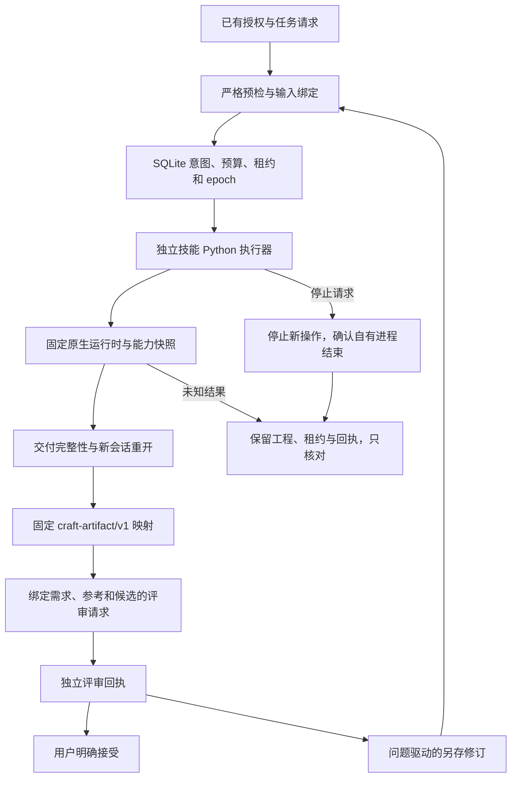

# PhotoCraft 任务控制候选

本轮实现对应 `openspec/changes/establish-v1-plugin`，插件 dev.39 锁定已发布的 dev.35 独立技能源，包含本地 `photocraft-harness` 技能与 TypeScript 运行时。源码回归与固定安装验收分别记录，完整 V1 继续开放。

技能入口增加只读 `workflow.py --check`、严格 JSON 与结构化错误、命令参数说明和工具 schema 摘要、递归对象断言、限定属性保全、PSD 实际功能矩阵及明确的滤镜目标合同。旧形状别名仍兼容。新增 native-facts.json 将固定 v1 保存格式中的蒙版归属、启用、链接状态、surface 描述与实际瓦片摘要，以及 type.info 的行范围、基线、字距和样式绑定到实际工程摘要。assertions 可核对 lineCount/lineRanges/tracking/font/size/leading；缺字覆盖和溢出仍不可精确核验，相关精确要求拒绝而不推断通过。明确 acceptedFontSubstitutions 映射才会替换缺失字体，替换后重新查询当前缺失列表。

插件 `src/cli.ts` 提供 create/run/status/reconcile/verify/judge/review-import（import-judge）/revise/stop/accept/artifact。SQLite 保存完整请求身份、预算、意图、写入权和事件；结果未知时不重新认领编辑。停止只向当前执行器拥有的进程组发送信号，跨重启只做观察。桌面可变工程写入明确拒绝，不能仅凭磁盘文件推断 GUI 未保存状态。

公开 artifact 映射消费 `contracts/artcraft/` 内逐字固定的公共 schema，摘要受 `docs/contracts-reference.json` 约束。bundle-export 在新目录复制交付、引用素材及任务／评审事实，用既有 evidenceRefs 关联本地证据；bundle-check 脱离账本及原路径复验。外部 bundleSha256 绑定不可变包版本；混合评估、父版本冲突、篡改和已取消任务拒绝。旧包缺少的血缘保持 UNKNOWN。跨仓消费者与固定安装复验仍开放，摘要不能证明评估器来源真实性。

原生技术通过不会自动产生创作回执。评审导入检查请求、需求、参考、工程、预览、清单、量表和评估器，并拒绝执行器自评；记录的上下文隔离声明仍需实际宿主证据。另存修订支持可检查的文字内容、字体、字号、图层命名和已有蒙版亮度／对比度调整层的有限属性，检查非目标对象及保护区域；无变化、重复消费、越界或预算耗尽拒绝。测试评审 fixture 不代表真实创作通过。

当前证据与剩余门禁见 [候选验证记录](evidence/optimization/candidate-validation.json)。运行方法：`python3 scripts/verify_candidate.py --skills-repo SKILLS_REPOSITORY --output EVIDENCE_JSON --native`；`--desktop` 额外执行受控桌面冷安装与自有会话，均使用临时目录，不覆盖用户应用。

固定发行及安装复验、755 条命令逐项业务上下文、实际宿主模型路由、真实独立创作评估、跨仓可移动血缘消费与外部 PSD 编辑器仍分别验收；不能由本地测试数量关闭。

原生目录实测为 headless 755 条、固定上游桌面 bridge 748 条。新增 `desktop-command-snapshot.json` 单独绑定桌面目录、参数说明及 MCP schema；初始及逐步内容漂移都会拒绝。桌面缺少的 7 条命令在安装／会话／输出前拒绝，不删除 headless 验收范围。桌面控制仍由临时目录中的固定应用提供，测试会确认自有进程结束。

父子修订共用根任务累计预算；所有祖先停止后禁止新增编辑。确认父任务 cancelled 前需核对子任务停止。活跃进程并发预留与保留工程占用分别计算；已确认退出的父执行器不阻塞 maxConcurrent=1 的另存子任务。受控停止保留迟到产物，不恢复为 completed。

当前局部调整修订支持已有 BrightnessContrast 层的 brightness／contrast，绑定目标问题和授权，要求启用蒙版及受保护区域。保存重开后保全蒙版瓦片摘要、非目标对象和像素，目标亮度由真实像素验证。固定候选安装和独立创作评审仍开放。

逐命令上下文索引见 [command-acceptance-index.json](evidence/optimization/command-acceptance-index.json)。755 条命令各有 headless／bridge 条目；文档、选择、素材、权限、结果断言、保存和修订要求尚未逐项审定，当前 1510 个上下文全部 NOT_RUN。`python3 scripts/command_acceptance.py check --skill-root SKILL_ROOT --index INDEX_JSON --evidence-root EVIDENCE_ROOT` 核对索引、能力及报告绑定。索引生成不是上下文验收；13.2／13.3 继续开放。

候选验证器可通过 `--reuse-skills-evidence VERIFIED_JSON` 复用完全相同技能源及相同 native／desktop 层的既有技能测试；原记录不改写，报告保留其摘要。失败、执行期间源码变化、原生有跳过、层或源码不同均拒绝复用，插件与静态检查重新执行。
