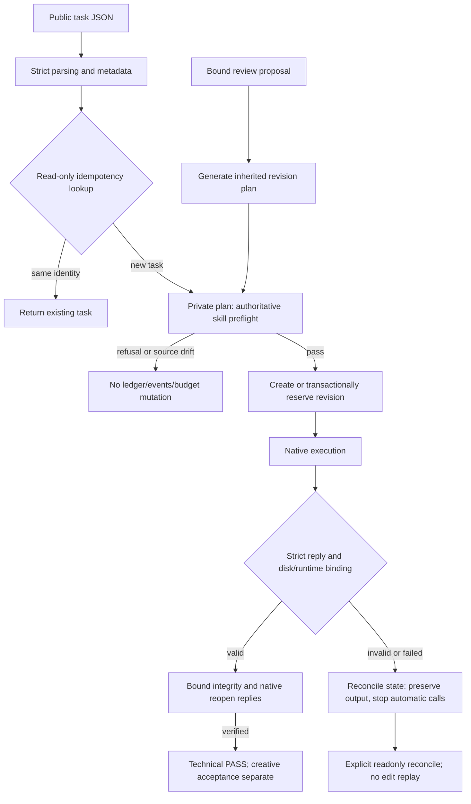

# Harness entry preflight and reply contract candidate

This continues existing PC-TX-005/task9.6 after public plugin dev.45/source dev.40. Only plugin-owned execution code changes; the13 managed skills, runtime, protocol authority and public tags retain their pinned identity. This candidate is unpublished and has no fixed-installed acceptance;9.6 remains open.

`create` strictly parses task JSON and metadata, then looks up idempotency read-only. An identical request returns its existing task even when delivery already exists. New requests run the authoritative skill's `workflow.py --check` using a private temporary plan, validate its reply and unchanged skill fingerprint, and recheck metadata before opening a writable ledger. Invalid plans, parameters, assets, references and runtime paths create no task, runtime or delivery directory. Duplicate keys and overflow retain nested field paths, including arrays and escaped property names.

Readonly ledger queries copy the database and journals into a private temporary directory and compare before/after and copied digests. Committed live WAL rows remain visible; a commit racing the copy refuses with a state conflict. Queries do not create source-side WAL/SHM files or mutate existing shared memory or task records.

`run` shares this preflight and preserves tasks, events and persistent plans on refusal. `revise` generates the effective inherited plan before checking it and its source delivery, then rechecks review, file bindings and budgets transactionally before reservation or child insertion. Actual native title revision proves that invalid text is refused without consuming the valid revision or changing the original project.

Subprocess replies reject duplicate keys, overflow, malformed JSON and contradictory preflight success. Execution success must match the saved manifest and pinned runtime; integrity and reopen replies bind the same manifest, project and runtime digests. Valid UTF-8 split across pipe chunks remains accepted. Nonzero exit no longer triggers automatic verification or replay: declared failures retain `failed`, ambiguous replies retain `unknown`, and only proven pre-execution validation may report `not_executed`.

The actual native fault case saves a project before injecting duplicate-key stdout. The native checkpoint reopens, automatic verification count is0, execution count is1, and another `run` refuses replay. Explicit reconcile can verify retained artifacts while the original reply remains unknown, with unchanged project bytes and execution count. Synthetic review receipts exercise coordination only and do not establish independent creative acceptance.

See the [candidate audit](evidence/optimization/harness-entry/candidate.json) and [complete regression](evidence/optimization/harness-entry-validation.json). All49 TypeScript tests, including3 native tests,48 Python tests and14 checks pass without skips. Byte-identical skill source reuses234 verified tests with equal native/desktop layers. Public CLI tests observe filesystem/ledger changes; authoritative skill installer/session-count evidence is kept distinct from the new Harness path evidence.

Task9.6 still requires raw-native per-command semantic stopping, MCP/serve streaming request/reply contracts, complete checkpoint reply bindings, and fixed public installation acceptance of this candidate. The1510 command contexts, actual host/model routing and independent creative acceptance remain separate. OpenSpec stays129/157 complete with28 open, zero tasks closed; no sync or archive.
