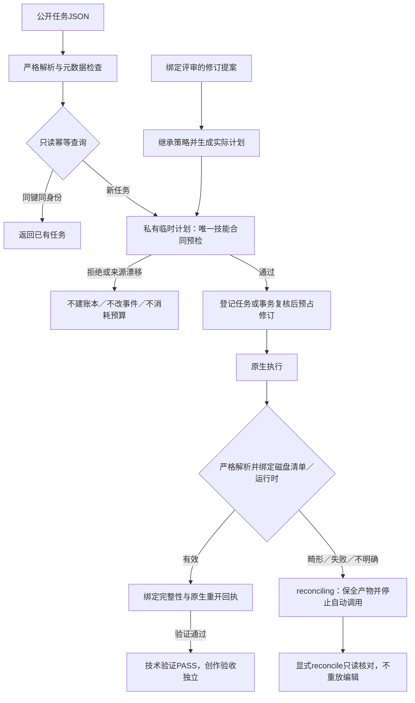

# Harness 入口预检与回复合同候选

本次推进既有 PC-TX-005 与任务9.6，建立在公开插件dev.45／技能源dev.40之上。插件自有执行代码已修改；13项技能仍来自原锁定标签，运行时、协议所有者和公开发行标签均未改变。本候选尚未发布或固定安装验收，不关闭9.6。

`create` 先严格解析任务JSON并验证元数据，再只读查询幂等身份；同键同输入直接返回原任务，输出已经存在也不重新预检。新任务在私有临时目录执行技能 `workflow.py --check`，确认回复合同及技能指纹不变，复核元数据后才建立可写账本。非法计划、参数、素材、引用和运行时路径均不会建立任务目录、运行时目录或交付目录。特殊键和数组中的重复键、溢出数值保留完整字段位置。

只读账本查询复制数据库及日志到私有临时目录，并核对复制前后及副本摘要；可以读取活跃WAL内的已提交行，复制期间发生提交则返回状态冲突。查询不会在原账本旁新建WAL／SHM，也不修改已有共享内存或原任务记录。

`run` 复用同一预检，失败时任务、事件和持久计划不变。`revise` 先构造实际继承策略与保全要求的修订计划，预检计划及源交付，再在事务中重读评审、源文件绑定和预算；成功后才预占预算及插入子任务。实际原生标题修订验证了错误文字类型被拒绝后仍能执行合法修订，原工程字节不变。

子进程回复拒绝重复键、溢出、畸形JSON和矛盾的预检成功结构。执行后的成功回复必须与实际 `manifest.json` 及锁定运行时身份一致；完整性与原生重开回复必须绑定对应清单、工程和运行时摘要。有效UTF-8字符跨管道数据块仍可解析。非零退出不再自动核验或重放：已声明的明确失败保留 `failed`，无法判断的回复保留 `unknown`，只有执行前验证可声明 `not_executed`。

真实原生故障用例在保存完成后注入重复键stdout：保留可重开的 `.pcraft`，自动核验次数为0、执行次数为1，重复 `run` 拒绝。后续显式核对可验证已有产物，但原提交回复仍为unknown，工程字节与执行次数保持不变。评审回执为协调测试夹具，不是独立创作接受证据。

验证与源码摘要见[候选审计](evidence/optimization/harness-entry/candidate.json)及[完整回归](evidence/optimization/harness-entry-validation.json)。本次49项插件TypeScript测试（含3项真实原生）、48项Python及14项完整检查通过，零跳过；技能源字节不变，按相同原生／桌面层级复用已核实的234项源测试。公开CLI用例核对文件与账本变化，安装／会话计数的原技能证据与本次Harness路径证据保持分开。

任务9.6仍开放：原生CLI的逐命令语义回复停止、MCP／serve流式请求及回复合同、检查点回复的全部语义绑定，以及上述新候选的固定发行安装验收需要继续完成。逐命令1510个上下文、实际宿主模型派发及独立创作验收不由本轮回归替代。OpenSpec仍为129/157完成、28项开放，本次关闭0项，不同步或归档。
