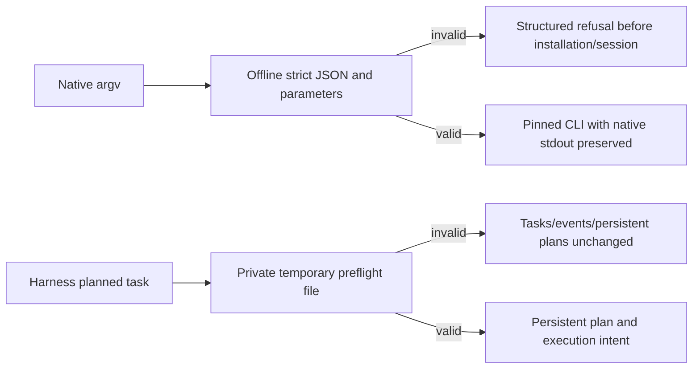

# Native argv preflight and Harness candidate supplement

PC-TX-005 and task9.6 remain authoritative. This unpublished candidate follows source dev.39/plugin dev.44; immutable tags and managed plugin snapshots are preserved.

Before installation, native run/batch/droplet/convert validate argv, strict JSON and registered command parameters. Refusals expose code, phase, outcome, retryable, recoveryAction, category and fieldPath. Thirteen invalid cases have zero installer/session/output effects, and all13 independent source skills refuse duplicate keys. The pinned maintained0.2.0-craft.1 accepts batch object arrays/actions wrappers; droplets separately accept tuples and bare IDs. Newer research checkout extensions are not current runtime features. Actual native creation, alternate-save revision, batch, droplet and32x32PNG conversion pass while preserving native JSON-line, text and empty stdout formats.

Runner preflight no longer writes persistent plans or failure events; its private temporary input is cleaned on success and error. Actual CLI audit still shows create initializes a ledger for a semantically invalid plan and run does not propagate complete structured preflight fields. Revision budget reservation, strict subprocess replies, MCP/serve streaming and native multi-step reply stopping need further work. These bounded static/native checks cannot close9.6.

Candidate, published fixed-installation evidence and complete command acceptance remain separate. Complete candidate regression passed13 checks:234 source tests,29 plugin TypeScript tests and48 plugin Python tests, zero skips and unchanged source fingerprints. New fixed release acceptance remains unexecuted. Task9.6 stays unchecked and28 plan tasks remain open.

## Dev.45 / source dev.40 release scope

This development release incorporates the candidate fixes into a pinned snapshot; older tags and archives remain immutable. Source dev.40 is public, and the vendor tool imports13 skills after tag/commit verification without manual snapshot edits. The initial13 checks passed234 source,29 TypeScript and48 Python tests with zero skips. Updated snapshot combination regression and public installation evidence are recorded in `native-argv-release-validation.json` and `native-argv-publication.json`; installation is not claimed before execution. Task9.6 remains open,129/157 complete and zero tasks closed.

Public dev.45/source dev.40 verification completed: ZIP digests and archive commits match immutable tags; previous tags/assets are unchanged; all4 release/main CI runs pass. Isolated Codex discovers14 skills without loading errors. Installed3 argv tests,13 single-skill zero-install refusals and all29 Harness tests pass without skips or installed-tree changes. Source has no CI;234 tests are local evidence. See [publication](evidence/optimization/native-argv-publication.json). Zero tasks closed;9.6 and the total28 gates remain open.

2026-10-09: an unpublished Harness candidate now supplies the create/run/revise preflight and main reply bindings described as gaps above. Public dev.45 is unchanged; streaming, per-command, checkpoint and new fixed-installation acceptance stay open. See [current candidate scope](PhotoCraft-Harness-Entry-Contract.md).
