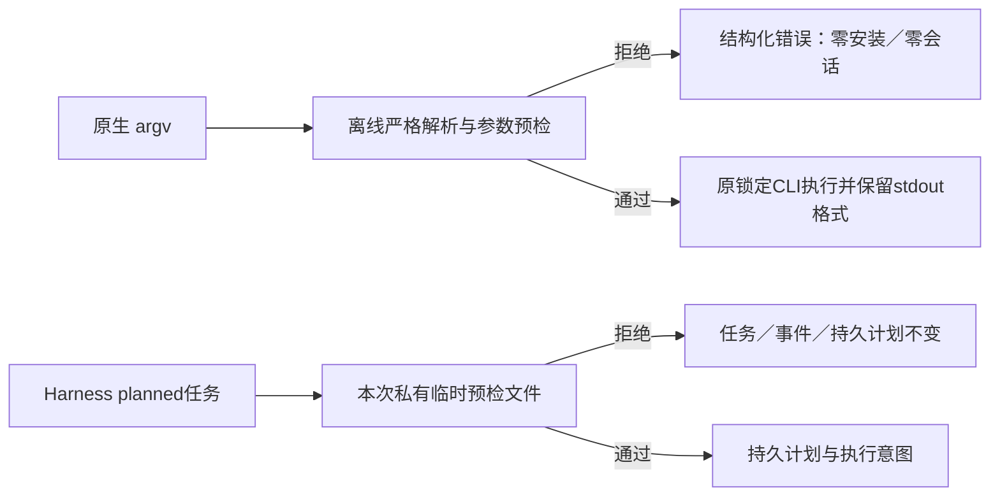

# 原生 argv 预检与 Harness 候选补充

现有 PC-TX-005 与任务9.6继续作为事实源。本次未发布候选建立在技能源dev.39、插件dev.44之后，不改变既有不可变标签或插件管理快照。

原生 `run`、`batch`、`droplet`、`convert` 在安装前校验公开参数、严格JSON及登记命令参数。错误保持 `code`、`phase`、`outcome`、`retryable`、`recoveryAction`、`category` 和 `fieldPath`。13类错误预检零安装／零会话／零输出，13个独立技能的重复键拒绝均通过。批处理动作格式以固定维护版0.2.0-craft.1为准：对象数组或actions包装；droplet另支持元组和裸ID。较新research工作树的批处理扩展不冒充当前运行时支持。真实原生创建、另存修订、批处理、droplet及转换通过，原来的JSON行、文字和空stdout格式保留。

Harness运行预检不再提前写入账本目录的计划或记录失败事件，私有临时预检文件在成功及异常路径均清理。真实CLI审计仍确认：create接收语义无效计划后先建立账本；run外层尚未传播完整结构化预检字段。修订预算预占、子进程回复、流式MCP／serve及原生多步骤回复停止仍需补齐，不能把本轮静态拒绝和健康原生场景升级成9.6完成。

候选证据、已发布固定证据与完整逐命令验收保持独立。完整候选回归13项检查通过：技能库234项、插件TypeScript29项及Python48项，零跳过，源码指纹保持一致；固定发行安装尚未执行。任务9.6未勾选，计划仍有28项开放。

## dev.45／技能源dev.40发行范围

本次开发发行将上述候选修复纳入固定快照；旧版本标签与压缩包保持不可变。技能源dev.40已公开，插件通过快照工具按标签与提交核验后接收13项技能，未手改管理快照。发布前13项检查通过：234项源测试、29项TypeScript及48项Python，零跳过。新快照组合回归与公开安装证据记录在 `native-argv-release-validation.json` 和 `native-argv-publication.json`；公开安装完成前不声称通过。任务9.6仍开放，129/157完成，本次关闭0项。

公开dev.45／源dev.40复验完成：公开ZIP摘要及归档提交匹配标签，前一版本标签与附件不变；发布提交与标签4项CI通过。隔离Codex发现14项技能，零加载错误；安装副本3项argv测试、13项单技能零安装拒绝及全部29项Harness测试通过，零跳过，安装树不变。源仓无CI，234项为本地证据。见[发行证据](evidence/optimization/native-argv-publication.json)。本次关闭0项，9.6和其余28项总门禁继续开放。
