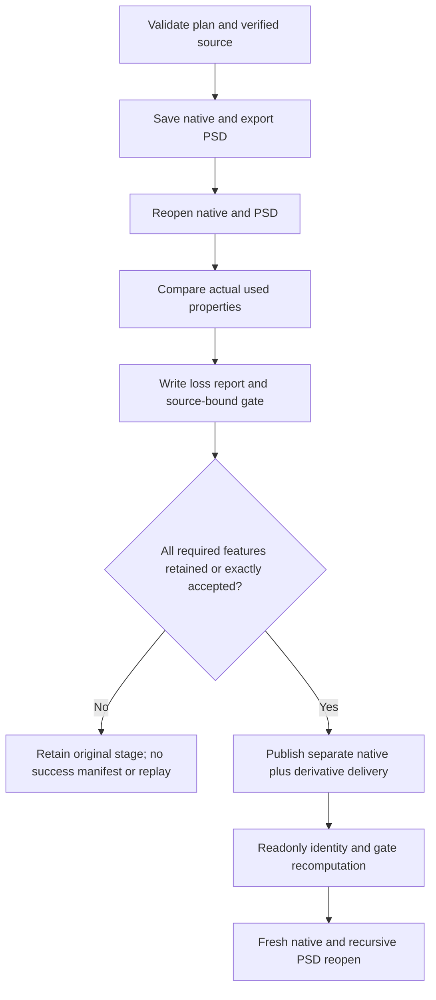

# PhotoCraft required PSD features

Source dev.36 implements PC-DM-005-FEATURE and PC-AR-002-N from the existing PhotoCraft plugin OpenSpec. The public workflow now refuses observed PSD losses/degradations and unknown or unobserved required features. Native projects remain authoritative. Published fixed-installation acceptance is a separate gate; no external editor, complete fidelity or creative acceptance is claimed.

`psdPolicy.requiredFeatures` accepts categories, exact recursive positions or `*`. `acceptedLosses` records an exact feature, observed status/hash and reason; `acceptedForSourceSha256` must match the verified source revision. New creation cannot invent a source-bound acceptance. Obtain a successful native source first, inspect the retained refusal, and export a separate explicitly accepted revision. An agent must not manufacture user acceptance. Existing authorization for the same source and loss remains valid.

`psd-acceptance.json` binds native, PSD, native/PSD inspections and plan digests. The exchange report and manifest bind the gate. Acceptance remains `ACCEPTED_LOSS`, with original statuses and `completeFidelity=false`. Legacy packages without a new policy/gate keep their historical readonly integrity behavior; they gain no PSD fidelity or acceptance evidence.

The unit tests cover loss/unknown refusal, stale status or observation, wrong source, unused acceptance, missing gates and semantic reopening. Native testing copies the export skill alone into an empty runtime, checks text/mask/adjustment/blend properties and PSD merged RGB pixels, revises text, refuses real smart-object structure loss and unverified effect requirements, reopens the retained native stage, and checks explicitly accepted loss. A coherently rehashed package containing another PSD is rejected by fresh native reopening. PSD IDs may be reassigned; recursive positions, all persistent layer properties and canvas are compared. Native-project identities remain strict.

Read the self-contained [exchange policy](../skills/photocraft-use/references/exchange-loss.md). Validation uses the source test suite with `CRAFT_PHOTO_PSD_FIRST_USE=1`; optional `CRAFT_INSTALLED_PHOTO_EXPORT_SKILL` selects the actual installed skill, and `CRAFT_PHOTO_PSD_POLICY_OUTPUT` / `CRAFT_PHOTO_PSD_POLICY_REPORT` retain an owned test directory and receipt. No user media, runtime downloads or raw test projects belong in Git.

## Fixed release acceptance

Public plugin dev.40 / skills dev.36 installs into isolated Codex 0.147.0 with 14 discovered skills and matching content hashes. The export skill alone passes cold-runtime PSD gating, retaining 108 native/export/input/receipt hashes; installed and copied files remain unchanged. All 28 installed TypeScript tests, including native policy inheritance and masked adjustment, pass. Current source regression passes 210 skills tests and 41 maintainer Python tests. Tasks 4.15, 5.6 and 12.12 close; the plan is 123/157 complete with 34 open.

[Scenario evidence](evidence/optimization/psd-acceptance-audit.json) and [publication verification](evidence/optimization/psd-release-publication.json) bind exact versions, platform and digests. Real Smart Object structure loss and unknown editable effects refuse as required; explicit loss acceptance is a test fixture, not user authorization. External editors, full PSD mask pixels/text styles, creative acceptance and full V1 remain unknown/unaccepted. OpenSpec stays active without sync/archive; marketplace eligibility stays false.

The installed readonly validator also passes nine moved-delivery, external-anchor, replaced-preview, missing-native, path-escape, symlink, duplicate-key, exchange-identity and native-substitute cases. [Evidence](evidence/optimization/psd-fixed-integrity.json).
