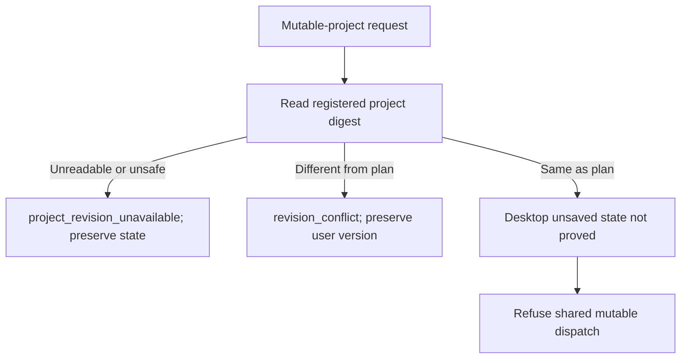

# Project revision and ownership

PC-TX-001 candidate, plugin dev.64 / source dev.49. The fixed source and runtime remain unchanged; this plugin increment restores the required saved-revision error. [Candidate evidence](evidence/optimization/project-ownership/candidate.json).

Before skill preflight or a task intent, a mutable-project request reads its registered native file. A changed digest returns typed `revision_conflict` (`validation`, `not_executed`, `$.expectedProjectSha256`); an unreadable or unsafe path returns `project_revision_unavailable` and requests inspection. Neither path starts an installer/native session, creates an output, or changes task/events. The existing file remains intact.

An unchanged disk digest does not prove the desktop has no unsaved edits. Until an atomic document/session ownership contract is implemented, shared mutable execution still refuses with `mutable_desktop_execution_not_supported`. Independent copies from an immutable verified source continue to use the existing workflow.

Real signed desktop control commands create a saved document, change its layer name without saving, inspect an increased revision and dirty state while disk bytes remain unchanged, and verify that refusal preserves both disk and memory. After saving, the same old plan returns revision_conflict and preserves the new version. This is actual GUI-engine control, not human pointer interaction or shared editing acceptance. Owned listeners and process cleanup are verified.

Tasks3.3/10.6 remain open for complete ownership, native competition, late epochs and fixed-public scenario acceptance. The two refusal cases do not close those tasks or full V1. Reproduce using `python3 -B scripts/verify_desktop_project_revision.py --skill-root <verified-installed-skill> --runtime-home <isolated-existing-cache> --evidence <new-report.json>` with Pillow and Node24 available.
