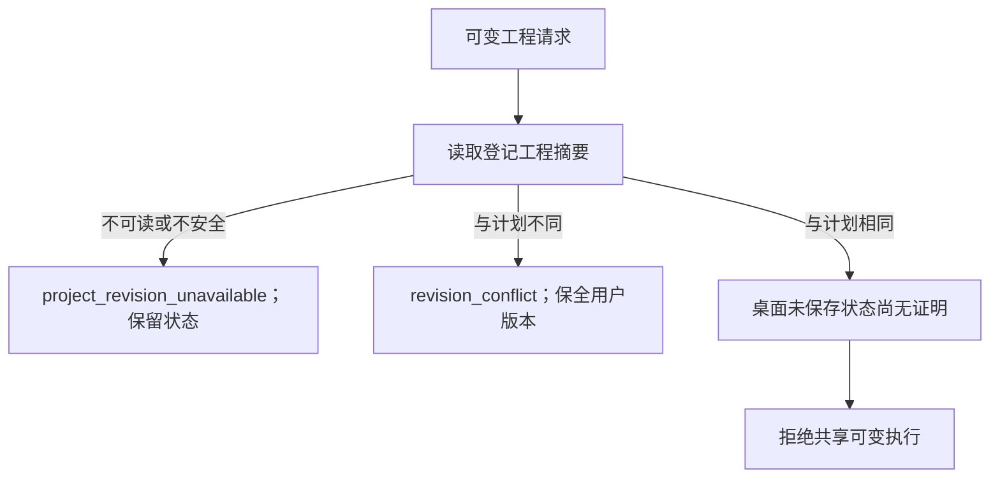

# 工程版本与写入权

PC-TX-001局部已发布验收，插件dev.64／源dev.49。固定技能源及原生运行时未改变，本增量恢复已保存工程版本冲突的既有错误合同。[候选证据](evidence/optimization/project-ownership/candidate.json)。

可变工程请求在技能预检及任务意图前只读核对登记的原生文件。摘要变化返回结构化`revision_conflict`（`validation`、`not_executed`、`$.expectedProjectSha256`）；路径不可读或不安全返回`project_revision_unavailable`并要求检查。两者均不启动安装器／原生会话、不创建输出、不修改任务或事件，原工程保留。

磁盘摘要相同不能证明桌面没有未保存修改。原子文档／会话写入权合同完成前，共享可变执行仍返回`mutable_desktop_execution_not_supported`。从不可变且已核验源创建独立副本继续使用原有工作流。

真实签名桌面控制命令创建并保存文档，修改图层名但不保存；检查修订号增加、dirty状态及磁盘字节不变，再验证拒绝不会改变磁盘或内存。保存后同一旧计划返回revision_conflict并保留新版本。此证据来自实际GUI引擎控制，不是人工鼠标交互或共享编辑验收；独占监听和进程清理另有核验。

3.3／10.6仍需完整写入权、原生竞争、迟到epoch和固定公开场景验收。两项拒绝不得关闭这些任务或完整V1。复验命令：`python3 -B scripts/verify_desktop_project_revision.py --skill-root <已核验安装技能> --runtime-home <隔离已有缓存> --evidence <新报告.json>`，需要已有Pillow及Node24。

公开dev.64实际安装副本重复验证两项桌面案例及全部110项Harness（15项原生），安装载荷与不可变ZIP一致且未修改。[固定证据](evidence/optimization/project-ownership/publication.json)。
