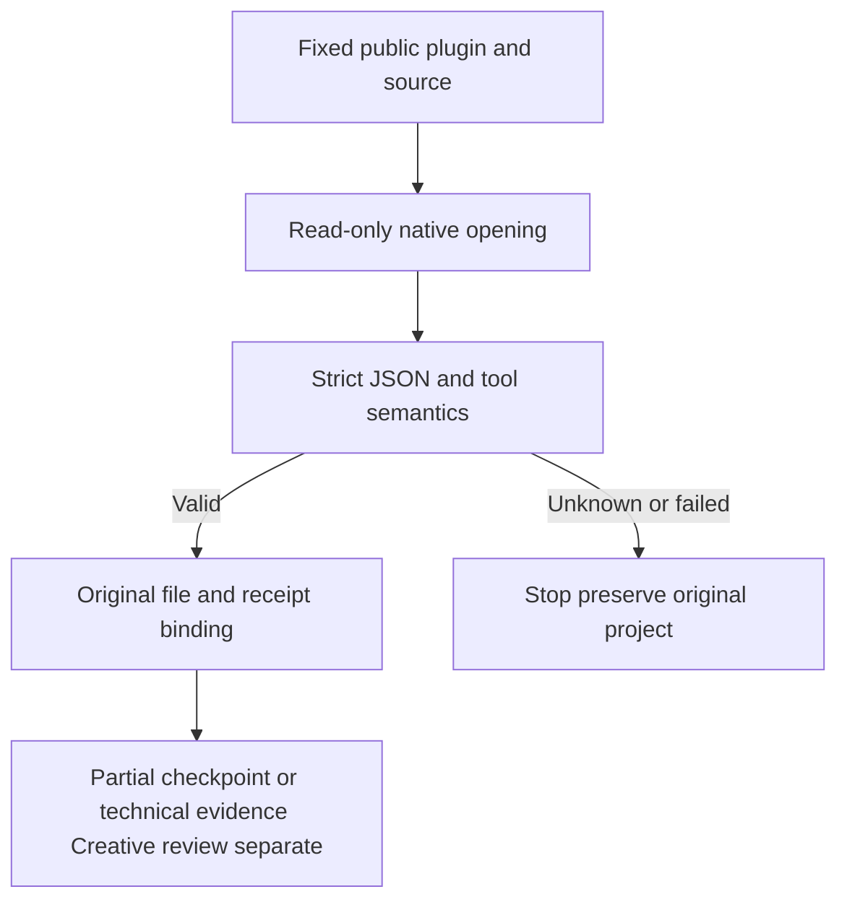

# PhotoCraft fixed read-only reply acceptance

Public plugin dev.47 pins independent source dev.41 and includes the earlier Harness checkpoint binding. PC-TX-005/task9.6 remain authoritative. Zero tasks close; full V1 is incomplete.

Delivery and retained-stage reopening reuse doc_open/doc_inspect semantic validation. CLI provides stable code, phase=verification, outcome, retryable and recoveryAction; unproven replies remain unknown, known tool failures remain failed. Harness binds original records/files/runtime. Reopening cannot replace the original execution outcome or authorize automatic replay.

All240 local source tests pass with0 skips. Plugin70 TypeScript tests (including4 native cases),48 Python tests and14 checks pass. Public ZIP digests/archive commits match immutable tags, previous source dev.40/plugin dev.46 tags and assets are unchanged, and all4 release/main CI runs pass. Source has no CI;240 tests are local evidence.

Isolated Codex0.147.0 discovers14 skills with zero loading errors. The actual installed copy passes70 Harness tests without skips. Its canonical installed skill passes14 faults injected after actual native read-only opening/inspection, stops forbidden subsequent calls and preserves original file digests; both healthy paths pass. The entire installed tree remains byte-identical. This does not claim the new readonly matrix ran separately in all13 scene skills or replace full entry counters, raw per-command, streaming editing or creative acceptance.

[Publication](evidence/optimization/readonly-reply-publication.json) · [Fixed faults](evidence/optimization/readonly-reply-fixed-native-faults.json) · [Source contract](https://github.com/full-aigc-skills/photocraft-skills/blob/v0.1.0-dev.41/docs/PhotoCraft-Readonly-Reply-Contract.md). Command index source digests alone changed; all755 commands/1510 contexts remain NOT_RUN. Task9.6 and the total28 remaining gates stay open.
