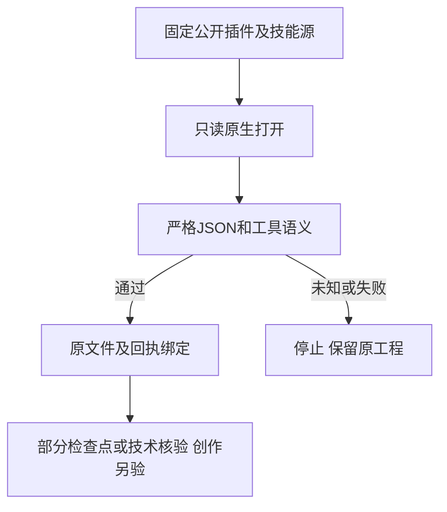

# PhotoCraft 只读回执固定验收

公开插件dev.47固定独立技能源dev.41，并接入此前的Harness检查点绑定。PC-TX-005／任务9.6继续作为事实源；本次关闭0项，完整V1未完成。

只读交付和失败暂存重开复用doc_open／doc_inspect语义校验。CLI输出稳定code、phase=verification、outcome、retryable及recoveryAction；不明确回复保持unknown，明确工具失败保持failed。Harness核对原记录、文件与运行时，重开不能改写原执行结果或产生自动重放权限。

源码240项测试零跳过通过，插件70项TypeScript（含4项原生）及48项Python、14项检查通过。公开ZIP摘要与归档提交匹配不可变标签，原源dev.40／插件dev.46标签和附件保持不变，发布提交及标签4项CI通过。源仓无CI，240项为本地证据。

隔离Codex0.147.0发现14项技能、零加载错误。实际安装副本70项Harness测试零跳过通过；安装的canonical技能在真实原生打开／检查后注入14类次故障，全部停止后续不允许调用，原文件摘要不变，两条健康路径通过；整棵安装树字节不变。此验证没有声称13个场景技能都完成了新的只读矩阵，也不代替完整入口计数器、raw逐命令、流式编辑或创作验收。

[发行证据](evidence/optimization/readonly-reply-publication.json) · [固定故障](evidence/optimization/readonly-reply-fixed-native-faults.json) · [源码合同](https://github.com/full-aigc-skills/photocraft-skills/blob/v0.1.0-dev.41/docs/PhotoCraft-Readonly-Reply-Contract.zh_CN.md)。命令索引只更新来源摘要，755命令／1510上下文仍全部NOT_RUN，9.6与其余28项总门禁仍开放。
