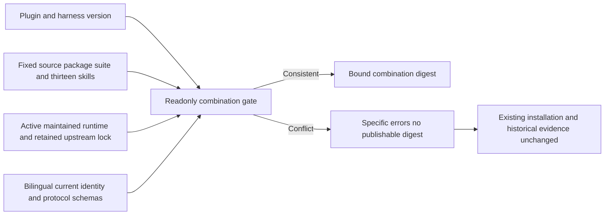

# PhotoCraft current release combination

OpenSpec PC-RL-003 and task9.9 require independent plugin, skill-source and runtime version roles. `scripts/release_combination.py --skills-source FIXED_SOURCE_DIRECTORY` reads a previously verified immutable source archive and the current plugin without downloading, installing or editing anything. It emits a deterministic `combinationSha256` only when the complete combination agrees.

Plugin and skill-source releases intentionally have different versions. The package and suite identify the same immutable source; the runtime version belongs to its own maintained build. The upstream0.2.0 lock is retained under `runtime/history/` and is never selected as the active execution lock. Schema bytes are checked against the pinned public protocol reference; actual owner Git-object checks remain a separate CI gate.

Acceptance must bind the public source ZIP and source tag/commit, actual public-tag plugin installation, complete installed/source skill hashes, negative cases in private copies and preserved prior releases. A moved-tag refusal is tested only in an owned local Git fixture. This gate does not prove native functionality, model routing, creative acceptance or marketplace eligibility.

Fixed dev.43 passes eighteen actual checker refusal cases, with previous dev.42 installation and public tags/assets unchanged. Thirteen cold standalone skills, ten native scene tasks, public use creation/revision and the valid legacy CLI plan pass. Tasks9.3 and9.9 close;129/157 complete and28 remain open.

[Identity audit](evidence/optimization/identity-acceptance-audit.json) · [Routing audit](evidence/optimization/routing-acceptance-audit.json) · [Publication](evidence/optimization/identity-release-publication.json).
