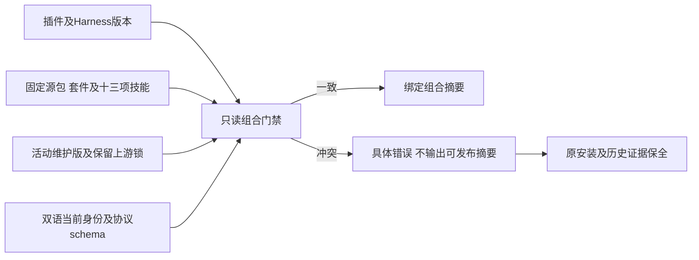

# PhotoCraft 当前发行组合

OpenSpec PC-RL-003与任务9.9要求分别核对插件、技能源和运行时版本角色。`scripts/release_combination.py --skills-source FIXED_SOURCE_DIRECTORY`读取已核验的不可变源码归档及当前插件，不下载、不安装、不编辑。只有完整组合一致时才输出确定性的`combinationSha256`。

插件与技能源有意采用独立版本。包与套件标识同一不可变技能源，运行时版本属于自身维护构建。上游0.2.0锁保留于`runtime/history/`，不作为活动执行锁。公共协议schema内容对照固定引用摘要；真实所有者Git对象核验仍由独立CI门禁执行。

验收必须绑定公开源码ZIP及源标签／提交、真实公共标签插件安装、源及安装技能完整摘要、私有副本负例和旧版保全。移动标签只在自有本地Git夹具测试。此门禁不能证明原生功能、模型派发、创作接受或市场可用性。
