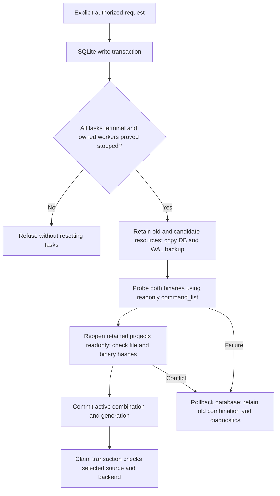

# Explicit runtime combination lifecycle

PC-RT-002 implementation candidate, plugin dev.62 / source dev.48. The public binary remains craft.1. Different-binary version upgrade and full scenario acceptance2.6 remain open. These controls operate on one existing task ledger and do not change PATH, the global plugin installation or the published skill snapshot.

Use `node src/cli.ts runtime-status --state-dir <absolute-state>` to inspect the selected combination without initializing state or installing a runtime. Generation0 means the historical fixed entry remains unmanaged. `runtime-upgrade` and `runtime-rollback` take `--request <absolute-json>`. The first upgrade also takes the original `--skill-root`; subsequent ordinary CLI tasks use the retained active source by default. Explicit foreign sources cannot bypass claim fencing.

Upgrade request fields:

```json
{
  "authorizationRef": "original-user-authority",
  "expectedGeneration": 0,
  "expectedActiveSourceSha256": "<64 lowercase hex from skillIdentity>",
  "candidateSkillRoot": "<absolute verified candidate skill directory>",
  "candidateSourceSha256": "<64 lowercase hex from skillIdentity>",
  "backend": "headless",
  "stateSchema": 1
}
```

`skillIdentity` is exported by `src/harness/preflight.ts`; its executor/resource digest differs from a Git commit or ZIP hash. Rollback requests contain only authorizationRef, expectedGeneration, expectedActiveSourceSha256 and stateSchema. A stale generation or identity refuses without selecting another version.



Planned, running, reconciling, verifying and review_ready tasks prevent switching. Terminal tasks with missing original supervisor proof also prevent switching. Independent processes serialize through the same SQLite write lock as task creation and claim. Old resources and versioned binaries remain present; switch receipts retain the state backup, previous probe and project hashes. A failed probe never promotes a new selection.

Headless and bridge probes use their own real capability snapshots. Bridge starts and closes an owned desktop; a bridge selection cannot silently run a headless Harness task. The current Harness still refuses mutable GUI editing until its ownership contract is accepted. Runtime switching grants no new editing authority.

Only existing ledger schema1 and photocraft-task/v1 are supported. No migration is implemented: unsupported state schemas fail with preservation, never downgrade or silently rebuild. Backups contain the database and applicable WAL/journal bytes plus digests. Rollback repeats draining, source, binary, backend, state and readonly project checks; it is not a version-string assignment.

Tests cover source/generation conflicts, state incompatibility, failed probes, binary changes after probe, independent-process transaction contention, readonly status, retained backup reopening and claim fencing. Native evidence additionally creates and saves an editable project, drains it by explicit cancellation, activates an independently retained source combination, rejects old-source dispatch, runs the selected source and rolls back while retaining project bytes. That native test deliberately uses the same craft.1 binary; mock different-version tests and source identity changes do not establish real different-version acceptance.
