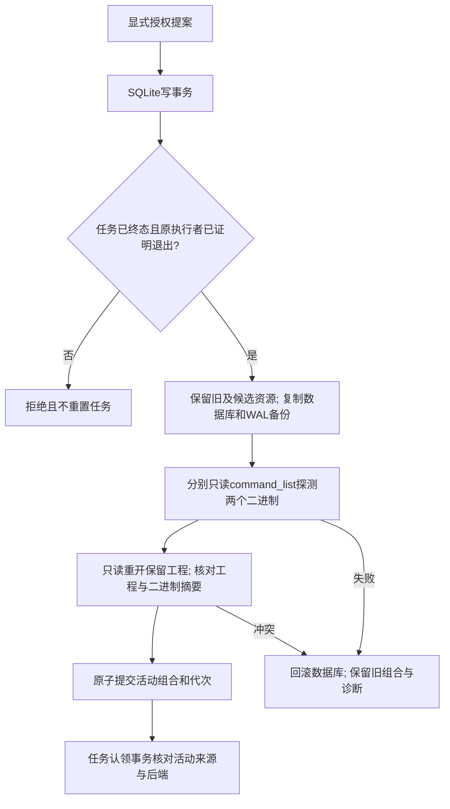

# 显式运行时组合生命周期

PC-RT-002已在固定公开插件dev.63／源dev.49的macOS arm64范围验收：全部6个场景、真实craft.1 → craft.5 → craft.1、108项Harness（15项原生）、headless／独占桌面独立探测、外链读取拒绝及下载边界通过；2.6完成。[验收](evidence/optimization/runtime-version/acceptance-audit.json)。完整V1、raw／streaming监督及GUI编辑所有权仍开放。控制范围是既有账本，不修改PATH或全局安装。

`node src/cli.ts runtime-status --state-dir <绝对账本目录>`只读查询选择，不初始化状态或安装运行时。generation0表示历史固定入口尚未受管。`runtime-upgrade`与`runtime-rollback`使用`--request <绝对JSON路径>`；首次升级另外指定原`--skill-root`，后续普通CLI任务默认使用保留的活动来源，显式外来来源不能绕过认领隔离。

升级提案字段：

```json
{
  "authorizationRef": "original-user-authority",
  "expectedGeneration": 0,
  "expectedActiveSourceSha256": "<skillIdentity生成的64位小写摘要>",
  "candidateSkillRoot": "<已核验候选技能绝对目录>",
  "candidateSourceSha256": "<skillIdentity生成的64位小写摘要>",
  "backend": "headless",
  "stateSchema": 1
}
```

`src/harness/preflight.ts`导出`skillIdentity`，执行资源摘要不同于Git提交和ZIP摘要。回退提案仅包含authorizationRef、expectedGeneration、expectedActiveSourceSha256和stateSchema；旧代次或来源冲突直接拒绝，不另选版本。



planned、running、reconciling、verifying及review_ready均阻止切换；终态任务缺少原监督退出证明也阻止切换。独立进程通过与创建／认领共用的SQLite写锁串行化。旧资源和版本目录不删除，切换回执保存状态备份、原版本探测和工程摘要；探测失败不提升活动组合。

headless与bridge分别从实际执行端生成能力快照；bridge使用自有桌面启动和关闭。bridge选择不能静默执行headless Harness任务；当前Harness仍拒绝可变GUI编辑，等待其所有权合同验收。运行时切换不增加编辑授权。

当前只支持既有ledger schema1及photocraft-task/v1，不实现状态迁移；未知schema保全并拒绝，不降级或重建。备份包含数据库、适用WAL／journal原字节和摘要。回退重复排空、来源、二进制、后端、状态及工程只读核验，不只是改版本字符串。

测试涵盖来源／代次冲突、状态不兼容、探测失败、探测后二进制变化、独立进程事务竞争、只读查询、备份重开和任务认领隔离。原生用例另完成实际工程创建保存、显式取消排空、独立保留来源切换、旧来源拒绝、新来源执行及回退，原工程字节不变。该原生用例明确使用同一craft.1二进制；模拟不同版本和技能源身份变化不代替真实不同版本验收。


历史dev.62证据使用相同craft.1二进制，仅关闭实施任务2.4／2.5；上述dev.63验收补齐不同原生版本证据，两个不可变发行记录均保留。
