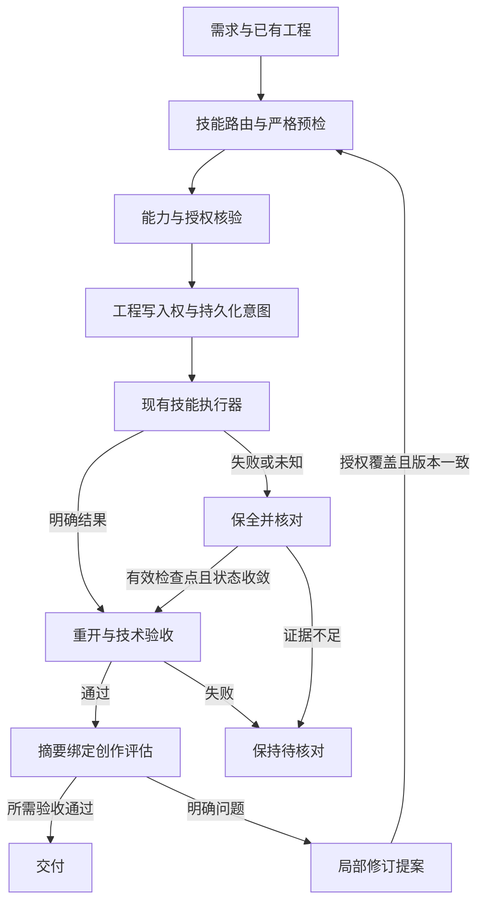

# PhotoCraft V1 Design

## Context

动机和边界见 [proposal.md](proposal.md)。当前独立技能源已有安装、命令执行、原生保存重开、局部修订、失败保全和交付完整性检查，插件消费锁定快照；完整 Harness、质量闭环和全场景验收仍未完成。以下领域表描述目标能力，实际状态以 tasks 和版本绑定证据为准。PhotoCraft 的代表任务是：用产品图制作海报与封面；重开 .pcraft 后文字、产品、背景仍可独立编辑；适用时输出经验证的 PSD。

## Goals / Non-Goals

**Goals:** 独立技能分发、可信运行时、声明式计划编译、可恢复任务、原生工程与导出双重交付，以及可追溯质量结论。

**Non-Goals:** 不重写上游应用，不实现 SaaS，不把原生交付降为只有图片/视频，未通过原生交付与宿主验收前不宣称插件已完成。

## Decisions

1. 独立 `photocraft-skills` 是知识事实源，插件同步不可变发布副本；替代方案“插件内手工维护一套技能”会形成漂移，予以拒绝。
2. 官方 CLI/MCP 是执行端，适配器编译声明式计划并核对能力；替代方案“LLM 直接拼接任意 shell”无法保证接口和副作用边界。
3. 拟采用 TypeScript/Node.js 24 LTS、SQLite 与内容寻址文件。替代方案云数据库/队列对本地单用户 V1 没有必要，出现跨机器需求后另提变更。
4. 副作用先写意图和幂等键；不明确结果保留工程占用并 reconcile。替代方案超时自动重试会产生重复编辑或重复计费。
5. 公共协议由 ArtCraft 规范持有，领域仓只拥有自己的 payload 与映射。替代方案每个插件独立定义公共 JSON 将导致不兼容。
6. 技术验证与创作评估分离，已有有效用户授权持续生效；只在超范围动作或修改授权约束时要求新的授权。

## Component design

完整中英文运行时设计位于 [中文架构](../../../docs/PhotoCraft-Runtime-Architecture.zh_CN.md) 和 [English architecture](../../../docs/PhotoCraft-Runtime-Architecture.md)。领域计划对象包括 ImageEditPlan, Document, Layer, Mask, TextBlock，以下能力逐项编译：

| 能力 | 行为边界 | 状态 |
| :--- | :--- | :--- |
| 分层文档与编辑身份 | 明确文字、产品和背景图层，保留名称、ID、顺序、混合模式与可见性；禁止为通过验收而整体扁平化。 | 计划中 |
| 蒙版与局部调整 | 将蒙版绑定至目标图层并记录作用区域；局部调整前后检查保护区域，确保未授权区域保持不变。 | 计划中 |
| 文字排版与字体依赖 | 保存文本内容、字体、尺寸、行距和布局；缺少字体时阻止需要精确排版的交付或显式接受替代。 | 计划中 |
| 海报封面尺寸变体 | 从源工程创建独立画幅变体，记录裁切、留白和安全区；尺寸变化不覆盖源工程。 | 计划中 |
| 原生与 PSD 保真 | 将 .pcraft 作为原生事实源；PSD 交付逐项验证所用图层功能并记录兼容损失；不宣称所有 PSD 无损兼容。 | 计划中 |
| 平面导出与来源 | 输出绑定源文档版本、ICC 或颜色空间与透明要求；外部生成素材保留来源回执，生成服务与图层编辑分开计量。 | 计划中 |

## State and recovery

核心状态为 planned、blocked、ready、running、reconciling、verifying、review_ready、completed、failed、cancel_requested、cancelled。同一原生工程单写；状态写入采用 epoch 防止过期执行者提交。原生应用不是账本事务的一部分，需要用检查点、文件核验和 reconciliation 收敛。父编排器不能将 accepted 当 completed，也不重复承担子插件的副作用重试。

## Risks / Trade-offs

| 风险 | 发现方式 | 处理与责任人 |
| :--- | :--- | :--- |
| R1 | 上游命令或格式变化 | Runtime owner：固定版本，比较 schema，重跑 fixture；未通过保持旧版 |
| R2 | 文字、透明或颜色交接损失 | Domain owner：保存源工程，生成 loss report，使用像素与对象检查 |
| R3 | 断线导致重复提交 | Harness owner：持久化意图与幂等键，先 reconcile，再决定重试 |
| R4 | 文档被误读为已实现 | Release owner：功能状态为 planned；无技能和运行时入口不得进市场 |
| R5 | ArtCraft 商标和受限许可代码边界 | Maintainer：独立实现；不复制上游 ArtCraft/Services 代码；品牌授权在发行前核对 |

## Migration Plan

新仓库无历史插件状态迁移。按 M1 运行时与技能 → M2 专业闭环 → M3 跨插件 → M4 宿主发布推进；ArtCraft 公共协议先定义，真实跨插件验收在领域端就绪后执行。升级采用版本目录与排空，保留旧组合；涉及状态 schema 时先备份，禁止不兼容回退。文档基线不进入可安装市场。

## Validation strategy

每条规范通过正向和失败场景验收；任务表关联需求 ID、测试与产物。验收覆盖清洁安装、原生重开、输出解码/像素检查、局部修改、中断恢复、重复调用与宿主加载。元数据检查、MCP 握手与单次调用不能替代完整创作验收。

## Deferred measurements

具体渲染吞吐、峰值内存、macOS x64/Windows/Linux 和各宿主版本兼容性必须通过 M2/M4 测量后填写，不影响当前本地优先架构与任务分解。名称与品牌资源使用由维护者在发行门禁核对。

## 交换报告实施决策

报告生成器属于各独立技能源，插件仅消费不可变快照。报告绑定原生、重开记录与导出摘要；lost/observed/unknown 不互相提升。ArtCraft 严格核验报告结构和实际文件，不允许 nativeSubstitute；历史无报告的交付不补造证据。实现与真实回归已验证，跨编辑器完整保真任务仍待验收。

## CLI 场景技能增量设计

参考 Dreamina 的 use / CLI / setup / 业务场景分层，但按真实命令划分任务。四原生 CLI 保持各自 argv 和工程保存语义；每个技能打包自己的最小运行资源，禁止跨技能文件路径。共有资源在仓库发布脚本中按摘要同步，避免手工维护多份逻辑。上游 ArtCraft 的 scene 保存、生成请求与异步轮询仅作为设计参考，不复制受限代码；本项目 ArtCraft CLI 的事实源为现有 src/cli.ts。原有 use 公开入口保持兼容。插件从新不可变技能源标签同步全部清单，宿主验收锁按新版本单独更新。

## Optimization baseline — 2026-10-08

### 原生逐条回复监督候选 — 2026-10-09

现有 raw run 在进程内连续执行，stdout 事后验证不能保证停止下一项命令。候选维护版在原始受信本地会话增加显式 `--supervised`，每次操作回复后必须收到匹配序号的确认，EOF／拒绝／不匹配即停止。独立技能源的候选监督器从原 argv 绑定请求，复用严格 JSON 与工具回复语义，通过才输出旧格式并确认。此方案避免用 MCP 的目录权限和命令限制替换原 raw 合同；已执行操作和保存文件保留，异常携带最后请求及已核验回执，不自动重放。

当前只完成 run 候选原语与定向原生回归。公开 cli.py、运行时锁、插件受管理快照保持原发行；持久恢复记录、batch／droplet、流式入口和固定安装仍须完成。该设计不修改 PC-TX-005 验收标准，不关闭任务 9.6。证据与来源绑定见 `docs/evidence/optimization/supervised-run/`。

2026-10-09 后续 batch 候选扩展：原生在创建输出目录前返回完整输入／目标／动作清单，由监督器按固定 codec 规则独立核对；逐文件仍使用独立 trusted-local 会话，打开、动作、保存分别确认，完整核验后才输出旧 ok 行及汇总。监督模式遇到任意失败停止整批；普通 batch 的逐文件失败后继续行为保留。额外缓冲回复帧和保存路径错配在确认前拒绝。公开接入须先绑定受支持二进制及能力，旧 CLI 忽略未知监督标志，不能执行后才检查兼容；公开锁、持久恢复、droplet／流式及固定安装仍开放。证据见 `docs/evidence/optimization/supervised-batch/`，9.6不勾选。

本节为待实施设计，关联 tasks 第 9–13 节。审计时插件为 dev.38、锁定技能源为 dev.34；它们只是本次调查锚点，未来当前版本仍从 manifest 与来源锁读取。已确认普通原生工作流和完整命令网关的严格解析不同：普通计划接受重复键，普通操作预检接受非有限值及缺失根别名；无副作用探针确认非有限计划能到达安装器调用点，未实际安装。已有同目标登记不等于工程级租约，已有包完整性不等于完整血缘，目录覆盖不等于 755 条命令已执行。

Dreamina 的参考限于单轮持久化控制、能力快照、摘要绑定 Judge 与版本约束修订。其单轮图像控制器、宿主提供 Judge、多轮调度未启用等边界保持，不外推为 PhotoCraft 已有能力。PhotoCraft 的本地恢复以进程、会话和原生检查点为依据，不能伪造远端查询。

## Optimization ownership and compatibility

| 责任位置 | 本增量落点 | 保持的兼容边界 |
| :--- | :--- | :--- |
| 独立 photocraft-skills | 统一 workflow、commands、native workflow、desktop 的校验与回执语义；维护场景描述、示例和领域验收 | use 及旧合法计划继续支持；单技能自带运行资源，不依赖插件或兄弟目录 |
| 独立技能源发布工具 | 从唯一维护来源生成脚本和公共参考副本，逐技能验证一致性及隔离安装 | 保留有意的技能专属内容，不用整体复制覆盖场景差异 |
| photocraft-plugin | 本地 photocraft-harness 技能、任务控制、恢复查询、评估协调和固定来源消费 | 不手改受管理技能；通过公开执行入口调用技能，不复制另一套领域执行器 |
| artcraft-plugin 权威协议 | 现有 craft-task/v1、craft-artifact/v1 的固定引用与消费映射 | 本次不修改公共 schema；需要新公共字段时先在权威仓走对应变更，不私自分叉 |
| research 与 Dreamina 仓库 | 只作来源参考 | 不作为本任务写入或同步目标 |

保留原定 TypeScript/Node.js 与 SQLite 的插件目标架构；独立技能已有 Python 执行器通过适配器复用，不为借鉴 Dreamina 改换技术栈。SQLite 管任务意图与状态，既有输出登记管目标认领；两者用共同身份关联，只有 Harness 决定恢复，底层不重复重试。实现须证明崩溃窗口收敛，不能声称 SQLite 事务覆盖原生引擎与文件系统。

## Optimization execution and recovery

先做无副作用预检，再按需要准备固定运行时、探测能力、取得工程写入权并持久化意图，最后执行原生操作。严格解析共享行为合同：重复键、非有限值、溢出、结构及语义错误不能在不同入口得到不同成功结论。源清单可读校验用于恢复已有绑定；动态返回字段在使用前核对。错误码及 phase、outcome、retryable、recoveryAction 由类型化结果生成，展示文本仅作解释。

能力快照绑定二进制、版本、平台、后端、会话及命令参数 schema；每步再检查文档、选择与 enabled。授权单独验证。计划身份包含需求与输入摘要、源工程版本、能力快照及授权引用；桌面未保存状态须有真实版本证据，否则拒绝共享写入。恢复不得通过换输出目录规避原任务。

建议的插件用户入口及公共适配关系如下，均为拟建接口，不是当前上游 CLI 命令：

| 入口 | 数据与动作 | 失败边界 |
| :--- | :--- | :--- |
| status | 只读任务、阶段、意图、已验证回执、检查点与预算 | 不安装、不启动编辑，不把锁释放当作任务结束 |
| reconcile | 核对原进程／会话与产物，受控只读重开副本，保留核对回执 | 证据不足保持 reconciling；不能重放未知编辑 |
| verify | 校验当前交付包、工程和技术断言，生成独立技术回执 | 哈希通过不代替原生重开或创作验收 |
| judge / import-judge | 发起并消费绑定摘要的宿主、外部或人工评估 | 不启动隐式模型或云调用，不自动宣布用户接受 |
| revise | 从有效问题生成提案，核对基础版本、变更白名单和授权后应用 | 超范围才补充授权；不自动开启无限后续轮次 |
| stop | 映射已有 cancel 合同，停止新增调度并处理任务自有进程 | 在途操作未核清时不能标 cancelled，不能终止用户进程 |

旧执行记录没有新 schema 或安全字段时保留原记录，返回可核对的兼容错误；禁止无备份地迁移或删除。允许从已核验、执行状态已收敛的检查点发起关联新修订；有效旧交付仍可按原公开合同使用，不伪造缺失血缘。预算绑定时间、截止时间、并发、磁盘峰值和轮数，重启不归零；本地编辑不套用积分审批。

## Optimization review and domain evidence

Judge 请求绑定 task／round、brief／reference、project／preview 摘要和 rubric 版本；导入时校验 request 身份、结构、摘要及是否已消费。记录真实评估器与上下文隔离方式，声明 freshContext 本身不算隔离证据。技术失败不能被视觉评分覆盖。修订把验证问题映射到 layerId、属性和保护区域，比较基础版本与实际差异，只应用允许集合，另存并重新验收；目标变化使旧评价失效。

递归结构断言覆盖嵌套图层、类型、关系、顺序、可见性、混合、边界和可编辑性；文字单独检查内容、字体替代、换行、字距和溢出；蒙版核对绑定与保护区域，超出当前像素检查器能力时拒绝或标明未知。PSD 按实际使用功能给出保留／降级／丢失／未知，不从重开或图层数推导全保真。PC-DM-007 单独承载复杂嵌套布局与滤镜扩展，不重用已关闭 PC-DM-004 的通过标签。

## Optimization traceability and rollout

| 顺序 | 需求 | 验收目标 | 任务 |
| :--- | :--- | :--- | :--- |
| P0 | PC-SK-004 | 唯一路由、场景合同与自包含生成 | 9.1–9.3 |
| P0 | PC-TX-005 | 全入口预检、回复和错误语义一致 | 9.4–9.6 |
| P0 | PC-RL-003 | 当前组合、维护版来源及历史证据分离 | 9.7–9.9 |
| P1 | PC-RT-002 | 内容绑定能力快照与漂移拒绝 | 10.1–10.3 |
| P1 | PC-TX-001/002/003 | 工程写入权、status/reconcile、取消和资源预算 | 10.4–10.12 |
| P2 | PC-QA-001/002、PC-AR-001 | 摘要绑定评估、受限修订与完整血缘 | 11.1–11.9 |
| P2 | PC-DM-001/002/003/005/007 | 结构、蒙版、文字、PSD、复杂布局和滤镜 | 12.1–12.15 |
| 持续 | PC-CM-001、PC-RL-001 | 逐命令、固定安装与真实宿主模型路由证据 | 13.1–13.6 |

tasks 第 9–13 节细化原未完成总任务，不建立第二套规格或重复要求已满足的相同证据。历史完成项及证据原样保留；新增四个需求 PC-SK-004、PC-TX-005、PC-DM-007、PC-RL-003 单独验收。每项先确认目标缺失测试，再最小实现和候选回归，最后在获授权的固定发行及安装副本验证。文档与规范检查只证明本次规划一致，不关闭任何新增实现任务。

发布继续采用独立技能源 → 不可变 tag／commit／摘要 → 插件锁定同步 → 实际安装验证，保留旧标签和组合。插件、技能、套件、运行时、协议各自独立版本；只要求同一身份声明一致，故意不同的版本必须解释映射。离线、原生、安装、宿主模型和人工接受分别记录；内容变化后旧证据仅在相关摘要与范围仍匹配时复用。此次仅文档落盘，不触发发布、市场状态、协议升级或主规格归档。

## Candidate implementation — 2026-10-08

后续“完成技能和插件的计划任务”已授权候选实现。本轮从既有变更继续，新增 TypeScript SQLite 任务控制器和插件本地 `photocraft-harness`；独立技能源 dev.35 提供严格预检、路由合同、能力内容绑定、递归对象断言、滤镜目标和 PSD 功能报告。实施结构见 [候选架构](../../../docs/PhotoCraft-Harness-Candidate.zh_CN.md)，完整回归及身份摘要见 [候选验证](../../../docs/evidence/optimization/candidate-validation.json)。本节更新执行阶段，不修改前述规范验收标准。

未知结果仅通过只读交付核验或失败暂存核对收敛。暂存恢复在原路径检查全部文件摘要并在新会话重开原生工程；只证明部分工程可恢复，状态继续 reconciling，技术与创作不升级。公开资产映射拒绝父版本冲突及混合轮次文件；完整可移动评估血缘仍需另行完成。

当前插件固定技能来源仍为 dev.34，候选源码通过不意味着已发布或新版本固定安装通过。固定发行、全部命令上下文、真实宿主模型、独立创作评估、外部 PSD 编辑器等未获得对应证据时保持开放。未执行 sync/archive，也不提升市场可用状态。

## PSD required-feature delivery gate — 2026-10-08

继续实现 PC-DM-005-FEATURE、PC-AR-002-N 及未完成任务4.15／5.6／12.12。独立技能计划增加可选 `psdPolicy`：`requiredFeatures` 声明所需已观察特性（类别、精确树位置或全部），`acceptedLosses` 仅按精确特性、实际状态和观察摘要记录已有用户接受及原因。接受不会把 lost／degraded／unknown 改写为 retained，也不声明完整保真。默认阻止已观察的丢失／降级；旧合法派生导出的未要求 unknown 继续显式报告。必要特性未知、未观察到、旧接受摘要不符及多余接受均拒绝成功交付。

原生保存与 PSD 重开后计算功能矩阵；先保存交换报告及绑定原生／PSD／检查／计划摘要的 `psd-acceptance.json`，再执行门禁。失败保留原路径暂存工程及诊断，不写成功清单、不自动重放。成功交付的只读完整性入口重新计算矩阵与门禁，原生核验入口还在新会话重新打开 PSD，防止只信先前检查文件。历史无新策略／门禁的旧包仍按原只读合同检查，不补造接受。固定发行及安装复验未通过前，上述任务保持未完成；外部编辑器版本及独立复验未执行时保持 NOT_RUN。

## Flat exports and asset provenance — 2026-10-08

继续实施 PC-DM-006／4.16–4.18，不改变既有规范。计划增加可选 `flatExport`（实际颜色模式、ICC 摘要、preserve／opaque／any 透明要求）与 `assetProvenance`。保存重开后逐个打开 PNG／JPEG／TIFF／WebP，读取当前颜色配置，生成受摘要保护的 RGBA8 观察，绑定原生工程和源版本。必要颜色／ICC／透明不符保留原生暂存、拒绝成功清单。完整性入口核对报告和观察，原生核验入口在新只读会话实际重新解码导出，临时观察仅写入核验器自有目录。当前归一化像素合同限 RGB8 源；其他模式/位深明确拒绝该可选合同，不改变旧合法导出入口。

生成素材来自用户已经取得的原始回执，本地工作流不调用生成服务。登记素材摘要、供应方／模型／请求 ID、原回执摘要及其声明用量，按摘要复制到交付包并随未替换素材继承。新素材不继承旧回执；回执错配在安装与编辑前拒绝。外部声明用量与本地执行命令数、零云生成调用分别记录；完整性不证明供应方身份、计费真实性或真实服务验收。历史无新合同的包保持原只读兼容，不补造颜色或来源证据。固定发行／安装验证完成前4.18保持开放。

## Capability identity and fixed backend acceptance — 2026-10-08

继续实施10.3，不用该子门禁关闭2.6。已验证二进制的版本／构建输出／平台随安装结果进入能力快照；owned desktop 将已核验应用版本及摘要绑定 bridge 快照。原有会话、后端、命令参数说明与工具 schema 内容摘要继续保留，enabled 仍动态检查且不代表授权。普通工作流所有工具调用前也核对快照，避免只对 command_run 检查而遗漏保存／导出路径。

受控验收分别运行 headless 与自有签名桌面：真实创建、编辑与保存后，仅注入只读发现回复的所需命令参数变更、工具 schema 变更或所需命令缺失。期望下一编辑零调用，已保存原生检查点在新会话可重开且摘要不变，桌面／MCP自有进程收敛。故障注入不代表固定原生服务自发漂移；完整升级排空、状态兼容回退、全部命令与创作质量分别保持未验收。候选与不可变固定安装证据分开记录。

能力重检以初始快照为基准，限定本次命令、调用工具及发现工具合同；完整发现摘要另记入逐次检查回执。无关漂移允许当前操作，之后使用已变化能力仍拒绝，不静默更新基准。新增14例双后端相关／无关漂移区分验收，逐次检查摘要受交付清单与 artifact 保护。

## Complete current release combination — 2026-10-08

继续实施9.9。只读发行检查联合插件／本地Harness、独立技能包／套件、源与安装副本13项完整内容摘要、活动维护版锁、非活动上游历史锁、中英文当前说明与固定公共协议schema。成功才生成确定性的当前组合摘要；同角色版本冲突、源或安装内容变化、当前文档来源混淆、历史锁误映射及协议内容漂移返回具体错误，不生成可发布组合摘要。插件与技能源、运行时版本保持独立，不为统一数字改写已发布标签或历史证据。

源码目录必须是已核验的固定源码快照；组合检查本身不联网、不写运行时或旧安装。公开ZIP／远端标签真实性与安装后拒绝行为由单独验收驱动证明，不用本地摘要冒充来源真实性、宿主模型或创作验收。负例仅在私有测试副本改写，各次核对原固定安装及历史证据不变；移动标签用私有Git仓库模拟，绝不移动真实已发布标签。

## Supervised conversion candidate — 2026-10-09

沿用9.6逐回复确认合同；安装前计划预检完成后，编辑前只读能力查询须匹配协议、子命令和确认格式。缺失能力只可在尚未发送编辑时标记not_executed。convert使用原生files::open/save，确认打开后保存；保存已发生时未知回复保留原始产物及unknown回执，不重放。该内部候选不替代公开二进制来源核验，不改变当前cli.py／craft.1，公开接入及固定验收仍开放。见双语转换监督文档和候选证据。

## Original-engine droplet supervision candidate — 2026-10-09

延续PC-TX-005及9.6原验收，不减少任何入口范围。droplet与CLI batch不是同一引擎路径；候选共用原droplet解析和计划准备，保留原引擎import／临时Session／save_doc，以及0–12 JPEG质量、输入顺序／重复文件和输出优先级。监督模式在文档打开之前核对规范化计划，逐条确认打开、动作、保存及完成清单；确认失败或原生错误停止整个监督批次，不执行后续文件、不重放。普通droplet仍逐文件收集失败并继续。公开craft.1入口和已锁定dev.42快照不因候选而自动更改。嵌套聚合动作内部、流式、公开来源绑定、持久恢复与固定候选安装仍需独立实现及验收。

## Integer literal overflow before installation — 2026-10-09

落实PC-TX-005既有任意深度数值溢出门禁，不引入64位限制。原生JSON有限f64边界在构造Python数值前按数值文本检查，避免Python整数字符串长度限制掩盖准确字段路径；有限大整数类型保持兼容。统一解析器同时作用于公开计划、MCP及工具内层回复，静态无效输入保持validation／not_executed、nonfinite_json_value、retryable=false、correct_plan，已发送工具的未知回复仍不重放。全部13个单独安装技能必须具备相同资源，固定来源及安装验收独立记录。

2026-10-09产物血缘验收：复用固定ArtCraft schema及源dev.43；旧包完整性必须先满足既有交付的必需文件和引用合同，空清单不得通过。真实创建／标题修订及移动后脱离原路径重开、串用／篡改拒绝由公开bundle-check验证；评估fixture与创作NOT_RUN明确分离，固定安装前不关闭5.3／11.9。见docs/PhotoCraft-Artifact-Lineage-Acceptance.zh_CN.md。

2026-10-09消费补充：固定dev.50通过17例原生血缘场景，但不可变ArtCraft109消费者拒绝自定义application/x-photocraft。新映射保留原生.pcraft主产物并使用权威已有二进制类型；旧完整包保持身份和只读兼容，明确旧MIME消费者未支持，禁止篡改旧包身份冒充新版。以实际固定dev.51消费和旧dev.50包检查补齐验收后才关闭5.3／11.9。

2026-10-09交换消费补充：实际ArtCraft109消费在MIME修正后仍拒绝源dev.43顶层psdGate。源dev.44保留门禁文件及摘要，将引用移入既有公共输出observations；只读兼容旧引用，冲突／缺失／错摘要拒绝。实际源候选两个原生包及17项逐文件替换已通过，固定源及插件验收前仍不关闭5.3／11.9。

2026-10-09取消恢复补充：Runner在启动独立监督进程前登记启动摘要及身份。监督进程独占自有进程组停止责任，主执行器中断后沿用原截止时间并写入退出回执；重启只核对身份及进程组消失，不向旧PID发信号。真实原生父子取消和78项候选回归通过；公开固定安装完成前3.9／10.12保持开放。

## Bound checkpoint revision implementation — 2026-10-09

继续PC-TX-002，不降低3.6／10.9门禁。失败暂存必须包含受文件摘要保护的原计划、运行时／能力身份、已验证绑定和登记资产快照；旧暂存缺失这些信息时仍允许既有只读核对，但不能凭补造的交付清单恢复编辑。新增检查点来源与正常delivery来源分开处理，绑定原failure记录、计划和保存工程摘要；保留原文件位置。新编辑只复制已经核验的保存工程与登记依赖，不重放原operations。

插件显式恢复修订仍须确认原监督进程退出回执及进程组消失、当前检查点未变、授权对象和剩余累计预算；新任务绑定原任务、检查点及独立输出。部分检查点不是technical PASS产物，不能伪造父artifact。关联身份与sourceRefs将按既有权威schema表达，并由独立原生及固定安装验收证明；全部实现和证据齐备前不关闭任务。

## PC-RT-002 显式隔离切换实施合同（2026-10-09）

沿用版本化安装目录和能力快照，新增 `runtime-upgrade`、`runtime-rollback`、只读 `runtime-status`。切换作用域为一个任务账本；普通任务不自动升级。提案绑定当前代次／技能源摘要、候选技能目录／摘要、headless或bridge后端及受支持账本状态schema。候选通过既有公开只读command_list命令工作流（编辑调用为零）发现实际版本、二进制及命令／工具schema；bridge使用自有桌面生命周期，不推断跨后端通过。

SQLite `BEGIN IMMEDIATE` 同时保护排空检查、切换和任务认领。任何非终态任务、未释放资源或不能证明退出的自有监督进程阻止升级；禁止用删除任务／重置epoch排空。取得写事务后，复制数据库及WAL为独立摘要绑定备份，保留原技能执行资源和旧版本目录；探测失败只保留诊断，不改变活动组合。成功后在同一事务发布来源／锁／能力快照与递增代次，旧组合进入回退栈。认领任务时核对同一活动来源，避免检查与认领之间切换；没有显式生命周期记录的历史账本保持固定入口行为。

当前控制器只读取既有ledger schema1和photocraft-task/v1，不进行状态迁移；不支持的schema拒绝并保全，不自动降级或重建。切换前用候选CLI只读打开账本内仍存在的原生工程并核对前后摘要；打开失败拒绝切换。回退重新执行同样的排空、状态、二进制和能力核验，而非只改版本字符串。运行时CLI、技能、插件、桌面及状态schema分别记录；未通过实际不同版本升级／回退、双后端及固定安装的范围继续保持2.6开放。

### PC-RT-002 不同原生版本验收增量（2026-10-09）

在dev.62显式生命周期基础上，新增真实craft.1 → craft.5 → craft.1验证，必须使用不同版本与二进制摘要，不用来源标签变化代替。既有craft.1包保持不可变；craft.5补丁与制品由独立技能源的固定上游、补丁、构建回执和发行摘要关联。先对隔离缓存验证旧／新保存工程的只读兼容、排空、代次、状态schema拒绝和回退后的真实执行，再完成新锁定技能源全回归、不可变源发行、插件快照更新与固定安装复验。两版bridge须各自探测，不能由headless外推。

技能源候选dev.49及插件候选dev.63不能因目录捕获或单一跨版本样例提升为PC-RT-002完成；2.6仍要求全部规范场景的当前适用证据。craft.5普通原生行为与内部监督模块分开；锁定新二进制不自动启用公开raw／流式监督或关闭9.6。原schema1状态只读兼容，不实现迁移；不兼容schema拒绝且保留原组合。
