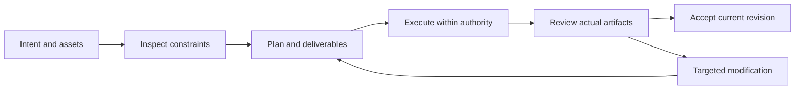

# PhotoCraft V1 — 功能与界面规划

> **文档说明**：V1 实施阅读视图；规范事实源为 OpenSpec。
>
> **版本**：1.0.0
> **最后更新**：2026-10-05
> **状态**：目标设计；尚未实现。事实依据与验收结果单独标注。

关联文档：[品牌边界](../1%E3%80%81PhotoCraft-%E5%91%BD%E5%90%8D%E4%B8%8E%E5%93%81%E7%89%8C%E8%AF%B4%E6%98%8E.md) · [技术方案](../5%E3%80%81PhotoCraft-%E6%8A%80%E6%9C%AF%E6%96%B9%E6%A1%88%E4%B8%8E%E8%B7%AF%E7%BA%BF.md) · [详细架构](../../../docs/PhotoCraft-Runtime-Architecture.zh_CN.md) · [OpenSpec](../../../openspec/changes/establish-v1-plugin/proposal.md) · [证据](../../../docs/evidence/runtime-baseline.json)

## 1. V1 功能模块

| 能力 | 行为边界 | 状态 |
| :--- | :--- | :--- |
| 分层文档与编辑身份 | 明确文字、产品和背景图层，保留名称、ID、顺序、混合模式与可见性；禁止为通过验收而整体扁平化。 | 计划中 |
| 蒙版与局部调整 | 将蒙版绑定至目标图层并记录作用区域；局部调整前后检查保护区域，确保未授权区域保持不变。 | 计划中 |
| 文字排版与字体依赖 | 保存文本内容、字体、尺寸、行距和布局；缺少字体时阻止需要精确排版的交付或显式接受替代。 | 计划中 |
| 海报封面尺寸变体 | 从源工程创建独立画幅变体，记录裁切、留白和安全区；尺寸变化不覆盖源工程。 | 计划中 |
| 原生与 PSD 保真 | 将 .pcraft 作为原生事实源；PSD 交付逐项验证所用图层功能并记录兼容损失；不宣称所有 PSD 无损兼容。 | 计划中 |
| 平面导出与来源 | 输出绑定源文档版本、ICC 或颜色空间与透明要求；外部生成素材保留来源回执，生成服务与图层编辑分开计量。 | 计划中 |

## 2. 宿主流程

## 3. 界面载体与责任

宿主展示计划卡、任务状态、预览与交付链接；原生编辑器承担精细人工编辑。诊断 JSON 供维护者读取，用户默认看到问题含义、影响范围与可执行恢复动作。

## 4. 异常状态

无素材显示缺失清单；无能力显示不支持项；执行中显示真实进度或未知进度；取消待确认保留占用；验收失败展示失败门禁与证据；不显示伪造百分比。

---

**文档版本**：1.0.0
**创建日期**：2026-10-05
**最后更新**：2026-10-05
**文档状态**：待评审；实现以 OpenSpec 任务和证据为准。
