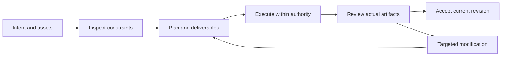

# PhotoCraft V1 — Interaction-Plan

> **Purpose**: V1 implementation reading view; OpenSpec is normative.
>
> **Version**: 1.0.0
> **Updated**: 2026-10-05
> **Status**: Target design, not implemented. Observations and acceptance evidence are identified separately.

Related documents: [Brand boundary](../1%E3%80%81PhotoCraft-Naming-and-Brand.md) · [Technical plan](../5%E3%80%81PhotoCraft-Technical-Plan.md) · [Detailed architecture](../../../../docs/PhotoCraft-Runtime-Architecture.md) · [OpenSpec](../../../../openspec/changes/establish-v1-plugin/proposal.md) · [Evidence](../../../../docs/evidence/runtime-baseline.json)

## 1. V1 functional modules

| Capability | Behavioral boundary | Status |
| :--- | :--- | :--- |
| Layered documents and edit identities | Keep explicit text, product and background layers with names, IDs, order, blend modes and visibility; flattening the entire document cannot satisfy editability acceptance. | Planned |
| Masks and local adjustments | Bind masks to target layers and record their scope; compare protected regions before and after local edits to prevent unintended modifications. | Planned |
| Typography and font dependencies | Preserve text, font, size, leading and layout; block typography-sensitive delivery when fonts are missing unless substitution is explicitly accepted. | Planned |
| Poster and cover variants | Derive separate aspect-ratio variants from the source project, recording crops, spacing and safe areas without overwriting the source. | Planned |
| Native and PSD fidelity | Use .pcraft as native authority; validate the PSD features used and record compatibility losses rather than promising universal lossless PSD support. | Planned |
| Flat export and provenance | Bind flat exports to source revisions, color profiles and transparency requirements; preserve receipts for generated inputs and account for generation separately from layer editing. | Fixed RGB8 contract verified; live generation/billing unverified |

## 2. Host journey

## 3. Surfaces and responsibilities

The host presents plans, task states, previews and delivery links; native editors support detailed manual editing. Diagnostic JSON is for maintainers; users see the issue, affected scope and actionable recovery.

## 4. Exceptional states

Missing assets show a checklist; missing capabilities show unsupported operations; running tasks show real or explicitly unknown progress; pending cancellation retains occupancy; failed acceptance shows gates and evidence. Do not fabricate progress percentages.

---

**Document version**: 1.0.0
**Created**: 2026-10-05
**Updated**: 2026-10-05
**Document status**: Ready for review; implementation status is governed by OpenSpec tasks and evidence.
